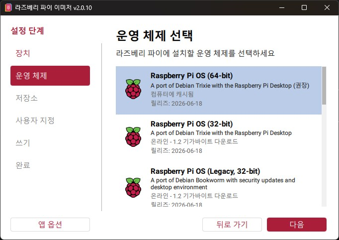
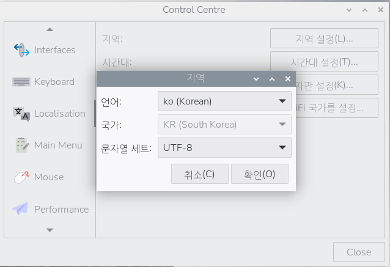
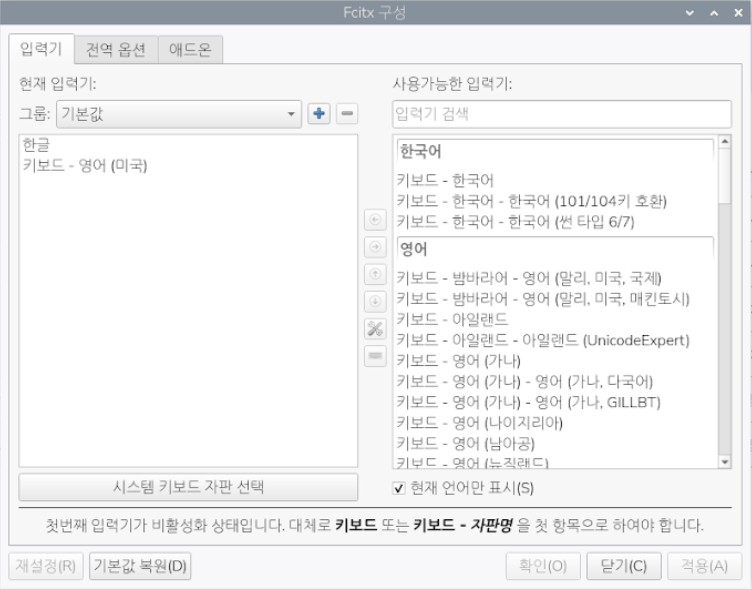

# 자율주행 입문

## 라즈비안 설치

### 라즈비안 최신판 설치



- Debian Trixie Raspbian Desktop 버전 선택
- 기타 호스트명, 로컬화, 사용자 및 Wi-Fi 설정 후 이미지 생성

#### 설치 후 초기 설정

- PuTTy SSH 등 생략
- 초기 업데이트
  - `sudo apt update && sudo apt upgrade -y` 실행
- 터미네이터 설치
  - `sudo apt install terminator` 실행
- Pi-Apps 설치 - 필요앱 설치 용이
  - `wget -qO- https://raw.githubusercontent.com/Botspot/pi-apps/master/install | bash`

#### 언어 설정

- 기본 설정 > Control Centre 선택



- 재부팅 후 터미널에서 아래의 명령 실행
  - `sudo apt install fonts-nanum fonts-nanum-extra -y`
- 한글 입력 설정

```bash
sudo apt install \
    fcitx5 \
    fcitx5-hangul \
    fcitx5-config-qt

im-config
```

- im-config 에서 fcitx5 선택 후 재부팅

```bash
fcitx5-config-qt
```



- 위와 같이 입력기 선택 후 적용, 닫기

### 개발환경 설정 및 설치

#### 파이썬 확인

```bash
$ python --version
Python 3.13.5
```

버전 확인

#### 개발툴 설치

Pi-Apps에서 VS Code 설치. Thonny는 기설치 확인됨

##### VS Code 설정

- 확장에서 `Korean` 검색 설치 후 재시작
- 확장에서 `Python` 검색 후 설치
- 확장에서 `Jupyter` 검색 후 설치

##### 개발 폴더 생성

라즈비안 루트폴더(사용자명) 아래에 Python_Bank 폴더 생성

##### VS Code 개발폴더 오픈

##### 터미널 오픈 후 가상환경 생성

```bash
$ python -m venv --system-site-packages .venv
```

- `--system-site-packages` : 글로벌 파이썬의 라이브러리를 전부 가져오기 기능
- `source .venv/bin/activate` 로 가상환경 파이썬 실행

##### 필요 라이브러리 설치

```bash
$ pip install opencv-python
$ pip install tensorflow
```

- tensorflow 사용 중 문제 발생 시 다운그레이드 필요함

```bash
$ pip uninstall tensorflow
$ pip install tensorflow==2.15.0
```


##### 교재로 소스 진행
