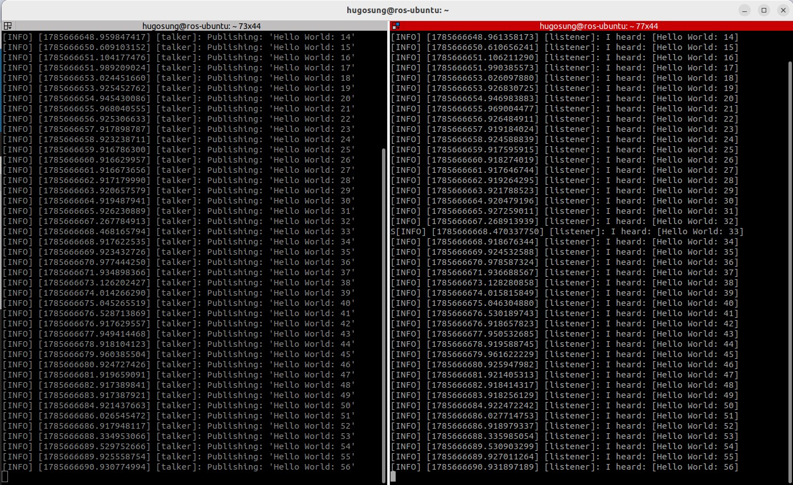
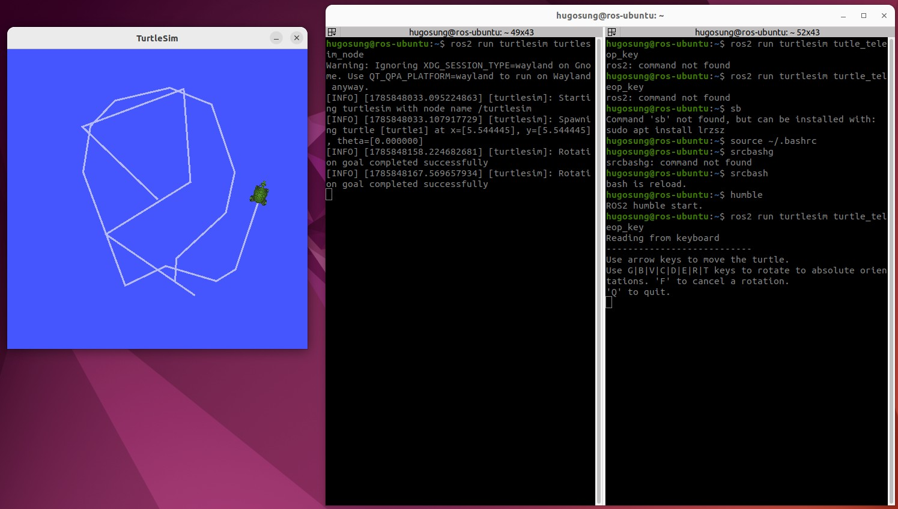

# ROS2 튜토리얼

## ROS2 입문

### ROS Humble 설치

- 라즈베리파이 5 모델은 우분투 22.04가 공식 지원되지 않으므로 우분투 24.04 권장
- 24.04의 경우 ROS2 Jazzy로 진행됨

[https://docs.ros.org/en/humble/](https://docs.ros.org/en/humble/) 사이트를 찾아갑니다.

아래의 순서대로 설치하면 됩니다.

#### 로케일 설정

```bash
locale  # check for UTF-8

sudo apt update && sudo apt install locales
sudo locale-gen en_US en_US.UTF-8
sudo update-locale LC_ALL=en_US.UTF-8 LANG=en_US.UTF-8
export LANG=en_US.UTF-8

# 재부팅

locale  # verify settings
```

위와 같이 입력한 뒤 우분투를 재시작합니다. 재시작후 `locale`을 확인하면 모두 `en_US.UTF-8` 로 변경된 것을 확인할 수 있습니다.

#### 소스 셋업

우분투 유니버스 리포지토리를 설치, 설정합니다.

```bash
sudo apt install software-properties-common
sudo add-apt-repository universe
```

계속해서 아래와 같이 설치합니다.

```bash
sudo apt update && sudo apt install curl -y
export ROS_APT_SOURCE_VERSION=$(curl -s https://api.github.com/repos/ros-infrastructure/ros-apt-source/releases/latest | grep -F "tag_name" | awk -F'"' '{print $4}')
curl -L -o /tmp/ros2-apt-source.deb "https://github.com/ros-infrastructure/ros-apt-source/releases/download/${ROS_APT_SOURCE_VERSION}/ros2-apt-source_${ROS_APT_SOURCE_VERSION}.$(. /etc/os-release && echo ${UBUNTU_CODENAME:-${VERSION_CODENAME}})_all.deb"
sudo dpkg -i /tmp/ros2-apt-source.deb
```

#### ROS2 패키지 설치

먼저 apt update와 upgrade를 먼저 수행합니다.

```bash
sudo apt update && sudo apt upgrade -y
```

설치할 종류는

```bash
# Desktop Install
sudo apt install ros-humble-desktop

# ROS-Base Install
sudo apt install ros-humble-ros-base

# Development Tool
sudo apt install ros-dev-tools
```

### ROS 테스트

아래와 같이 두 터미널에서 하나씩 실행합니다.

#### 1번 터미널

```bash
source /opt/ros/humble/setup.bash
ros2 run demo_nodes_cpp talker
```

#### 2번 터미널

```bash
source /opt/ros/humble/setup.bash
ros2 run demo_nodes_py listener
```

#### 실행결과



### bash 설정

Bash(Bourne Again SHell) : Linux와 macOS(기본 셸 변경 전), Unix 시스템 등에서 가장 널리 사용되는 표준 셸(Shell)이자 명령줄 인터프리터

터미널이 명령어를 입력하는 대화형 인터페이스며 이 환경설정을 위한 파일이 .bashrc

이를 수정하여 ROS2에 필요한 터미널 초기화를 할 수 있습니다.

#### 현재 쉘 확인

```bash
echo $SHELL
/bin/bash
```

아래와 같이 여러 쉘이 존재합니다. 그중 하나가 bash 입니다.


| **셸 이름**                  | **실행 명령어** | **주요 특징 및 특징적 기능**                                                                                            |
| ---------------------------- | --------------- | ----------------------------------------------------------------------------------------------------------------------- |
| **Bourne Shell**             | `sh`            | 최초의 표준 유닉스 셸. 기능은 단순하지만 거의 모든 유닉스/리눅스 환경에서 기본 호환됩니다.                              |
| **Bash**(Bourne Again Shell) | `bash`          | 대부분의 리눅스 배포판(Ubuntu, CentOS 등)의 기본 셸.`sh`와의 호환성을 유지하며 명령어 이력, 자동완성 기능을 제공합니다. |
| **Zsh**(Z Shell)             | `zsh`           | Bash의 기능을 모두 포함하며 강력한 자동완성, 플러그인 확장(Oh My Zsh 등), 테마 지원이 뛰어납니다. (최근 macOS 기본 셸)  |
| **C Shell / Tcsh**           | `csh`/`tcsh`    | C 언어 문법과 유사하게 설계된 셸. 스크립트 작성 시 C 언어 사용자에게 익숙합니다.                                        |
| **Korn Shell**               | `ksh`           | Bourne Shell을 기반으로 C Shell의 편리한 대화형 기능을 흡수하여 만들어진 상용 유닉스 중심의 셸입니다.                   |
| **Fish**                     | `fish`          | 별도 설정 없이도 명령어 하이라이팅, 지능형 자동완성, 풍부한 웹 기반 설정 기능을 기본 제공하는 현대적 셸입니다.          |

#### 에디터로 .bashrc 오픈

```bash
code ~/.bashrc
```

이후 오픈된 .bashrc를 VS Code에서 수정합니다. 맨 아래에 다음의 내용을 추가합니다.

```shell
# ROS Init
source /opt/ros/humble/setup.bash
echo "ROS2 humble!"
```

저장 후 .bashrc를 재시작합니다.

```bash
source ~/.bashrc
ROS humble!

# 
```

#### Alias로 편하게 실행명령 지정

```shell
alias humble="source /opt/ros/humble/setup.bash;echo \"ROS2 humble is started!\""
alias srcbash="source ~/.bashrc;echo \"Bash is reloaded\""
```

`source ~/.bashrc` 로 재시작 후 위의 키워드를 실행하면 ROS2와 bash를 재시작할 수 있습니다.

#### DDS 설정

ROS2는 ROS1과 달리 DDS(Data Distribution Service)기반 통신으로 더 나은 실시간성을 제공하고 있습니다.

#### 개별 도메인 설정

.bashrc에 각 엣지 컴퓨팅 별로 도메인을 가지고 있어야. 여러 장비를 통신할때 문제가 발생하지 않습니다.

```shell
alias srcbash="source ~/.bashrc;echo \"Bash is reloaded\""
alias ros_id="export ROS_DOMAIN_ID=42"
alias humble="source /opt/ros/humble/setup.bash;ros_id;echo \"ROS2 humble is started!\""

```

### 라즈베리파이 ROS2 설치

라즈베리파이 5에서는 라즈비안에 ROS2 설치도 가능합니다만, 설치 도중 오류가 많이 발생하고 해결하는데 어려움이 있습니다.
따라서, Ubuntu 26으로 진행합니다.

#### Ubuntu 26 설치

라즈베리파이에는 2026년 5월 Ubuntu 26이 발표되었습니다.


| 항목               | Ubuntu 24.04 LTS      | Ubuntu 26.04 LTS        |
| ------------------ | --------------------- | ----------------------- |
| Raspberry Pi 5     | ✅ 매우 안정적        | ✅ 공식 지원            |
| 자료/예제          | ⭐⭐⭐⭐⭐ 많음       | ⭐⭐⭐ 아직 적음        |
| ROS2               | **Jazzy와 궁합 좋음** | 최신 ROS2 쪽이 적합     |
| Python/패키지 호환 | 안정적                | 일부 라이브러리 대응 중 |
| 장기지원           | 2029년까지 기본 지원  | 2031년까지 기본 지원    |
| 강의 환경          | **추천**              | 조금 이른 편            |

하지만 CSI 카메라나 GPIO를 사용하려면 Ubuntu 26.04 버전을 사용해야 합니다. 26.04 는 ROS2 Lyrical Luth (LTS) 를 지원합니다.

#### ROS2 Lyrical Luth 설치

나머지 마지막 ROS2 Desktop 버전 이전까지는 모두 동일하며, 아래의 설치만 하면 됩니다.

```bash
$ sudo apt install ros-lyrical-desktop
```

#### 설치 후 확인

설치 후 터미널에서,

```bash
$ source /opt/ros/lyrical/setup.bash
```

셋업을 실행하고, 아래 명령어를 실행해 봅니다.

```bash
$ ros2 --help
```

ros2 명령어에 대한 도움말이 나타나면 제대로 설치된 것입니다.

## ROS2 기초

### turtlesim 설치

humble과 lyrical의 경우 차이가 납니다.

```bash
sudo apt install ros-humble-turtlesim
sudo apt install ros-lyrical-turtlesim
...
ros-humble-turtlesim is already the newest version ...
```

#### turtlesim 실행

터미네이터에서 두 터미널을 열고 humble을 실행합니다.

- 첫번째 터미널에서는

```bash
ros2 run turtlesim turtlesim_node
```

이를 입력하면 TurtleSim GUI 창이 뜹니다.

- 두번째 터미널에서는

```bash
ros2 run turtlesim turtle_teleop_key
```



위의 그림과 같이 나타납니다. 방향키로 거북이를 이동시킬 수 있습니다.


| 키  | 회전 방향                | 각도   |
| --- | ------------------------ | ------ |
| `G` | 오른쪽                   | 0°    |
| `T` | 오른쪽 위                | 45°   |
| `R` | 위쪽                     | 90°   |
| `E` | 왼쪽 위                  | 135°  |
| `D` | 왼쪽                     | 180°  |
| `C` | 왼쪽 아래                | -135° |
| `V` | 아래쪽                   | -90°  |
| `B` | 오른쪽 아래              | -45°  |
| `F` | 진행 중인 절대 회전 취소 | —     |
| `Q` | `turtle_teleop_key`종료  | —     |

하지만, 위의 표대로 움직이지는 않습니다. 참고만 하세요.

[다음](./ROS2_3.md)
