# ROS2 튜토리얼

## ROS2 기본 학습

### 학습 순서

* ROS 개념 알아보기
* ROS와 turtlesim
* ROS 프레임워크의 메인 통신 요소
* 로그를 통한 인트로스펙션
* 런치파일 사용법
* 데이터 기록 및 재생법

### ROS 개념

ROS(Robot Operating System)는 로봇 애플리케이션의 구축, 배포, 실행 및 유지 관리를 위한 프레임워크, 도구 및 라이브러리를 제공하는 오픈 소스 생태계를 뜻합니다.

물류 분야에서는 내비게이션, 지도 작성, 모션 제어 및 여러 로봇 간의 조정 기능을 제공하여 로봇이 창고에서 물품을 이동하도록 돕습니다. 제조 분야에서는 비전 시스템을 사용하여 정확한 핸들링을 구현하는 자동화된 피킹 및 배치 작업과 같은 고급 작업을 가능하게 합니다. 의료 분야에서는 ROS가 환자 치료를 지원하고 임상 워크플로의 효율성을 향상시키는 로봇 시스템을 지원합니다.

이름과 달리 ROS는 전통적인 의미의 운영 체제가 아니라, 개발자가 다양한 플랫폼과 프로그래밍 언어를 사용하여 로봇을 만들 수 있도록 도와주는 도구 및 라이브러리 모음입니다.


[출처 : ROS2 공식사이트](https://docs.ros.org/en/lyrical/About-ROS.html)

#### 프레임워크의 구조

ROS 프레임워크는 로봇의 통신이 가능하게 하는 기반구조로 메시징, 표준 인터페이스 외에도 다양한 기능을 포함하고 있습니다.

ROS는 다음과 같은 기본 구성 요소로 이루어져 있습니다.

* 노드
* 인터페이스(토픽, 서비스 및 액션)
* 매개변수
* 클라이언트 라이브러리

#### 도구

ROS의 도구들은 개발자들이 로봇 시스템을 구축, 테스트 및 모니터링에 도움을 줍니다.

`시각화 도구`를 사용하면 테스트 중에 로봇의 센서, 위치 및 주변 환경을 3D로 표시할 수 있고, `발사 제어 도구`를 사용하면 개발자는 실제 배포 전에 로봇의 시동 및 작동 관리 방식을 정의하고 검증할 수 있습니다. `데이터 기록 및 재생 도구`를 사용하면 로봇의 동작을 기록하여 나중에 검토 가능합니다.

#### 통합 도구

ROS는 다른 오픈 로보틱스 플랫폼과 연동하여 개발 및 배포를 더욱 쉽게 만듭니다.

* [Gazebo](https://gazebosim.org/home) : 물리 기반 시뮬레이션을 제공하므로 개발자는 실제 하드웨어를 사용하기 전에 가상 환경에서 로봇을 테스트합니다.
* [Open-RMF](https://www.open-rmf.org/) (로봇 미들웨어 프레임워크): 다양한 로봇들이 협력하고 엘리베이터, 출입문과 같은 건물 시스템과 상호 작용할 수 있도록 지원합니다.
* [ros-controls](https://control.ros.org/rolling/index.html) : ROS를 사용하여 로봇을 실시간으로 제어할 수 있도록 해줍니다.

### 튜토리얼

#### turtlesim 재시도

초보자를 위해 설계된 경량 2D 시뮬레이션 도구인 turtlesim을 사용하면 간단한 시각적 환경에서 핵심 ROS 개념을 학습합니다.

##### 터틀심 설치

```bash
$ sudo apt update
$ sudo apt install ros-lyrical-turtlesim
```

이전에 이미 설치가 되어 있습니다.

패키지 설치를 확인하려면 아래와 같이 입력합니다.

````bash
$ ros2 pkg executables turtlesim
turtlesim draw_square
turtlesim mimic
turtlesim turtle_teleop_key
turtlesim turtlesim_node
````

##### ROS 터미널 환경설정 단순화

ROS 터미널 환경 설정을 하려면 아래의 명령어를 터미널 마다 실행해야 합니다.

```bash
$ source /opt/ros/lyrical/setup.bash
```

하지만 매번 입력하기 싫으면 아래와 같이 .bashrc에 자동으로 추가합니다/

```bash
$ echo "source /opt/ros/lyrical/setup.bash" >> ~/.bashrc
$ source ~/.bashrc
```

또는 nano 에디터에 들어가서 직접 .bashrc 파일을 열어 마지막에 추가해도 됩니다.

```bash
$ sudo nano ~/.bashrc

---
echo "ROS Init!"
source /opt/ros/lyrical/setup.bash
```

##### 터틀심 시작

아래의 명령어로 터틀심을 시작합니다.

```bash
$ ros2 run turtlesim turtlesim_node
[INFO] [turtlesim]: Starting turtlesim with node name /turtlesim
[INFO] [turtlesim]: Spawning turtle [turtle1] at x=[5.544445], y=[5.544445], theta=[0.000000]
```

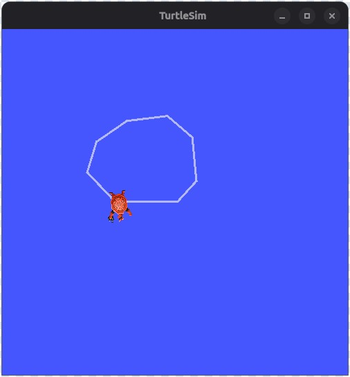

랜덤하게 바뀌는 거북이 모양의 TurtleSim 창이 열립니다.

##### 터틀심 사용

새 터미널을 열고 ROS 2를 다시 소싱합니다.

첫 번째 노드의 거북이를 제어하기 위해 새 노드를 실행합니다.

```bash
$ ros2 run turtlesim turtle_teleop_key
```

키보드의 방향키를 사용하여 거북이를 조종하세요. 거북이는 화면을 돌아다니며, 몸에 달린 "펜"으로 지금까지 이동한 경로를 그립니다.

- list

각 명령어의 하위 명령어 를 사용하면 노드와 해당 노드에 연결된 토픽, 서비스 및 액션을 확인할 수 있습니다 .

```bash
$ ros2 node list
$ ros2 topic list
$ ros2 service list
$ ros2 action list
```

터틀심에서 위 명령어의 결과는 아래와 같습니다.

```bash
hugo@hugo:~$ ros2 node list
/teleop_turtle
/turtlesim
hugo@hugo:~$ ros2 topic list
/parameter_events
/rosout
/turtle1/cmd_vel
/turtle1/color_sensor
/turtle1/pose
hugo@hugo:~$ ros2 service list
/clear
/kill
/reset
/spawn
/teleop_turtle/describe_parameters
/teleop_turtle/get_parameter_types
/teleop_turtle/get_parameters
/teleop_turtle/get_type_description
/teleop_turtle/list_parameters
/teleop_turtle/set_parameters
/teleop_turtle/set_parameters_atomically
/turtle1/set_pen
/turtle1/teleport_absolute
/turtle1/teleport_relative
/turtlesim/describe_parameters
/turtlesim/get_parameter_types
/turtlesim/get_parameters
/turtlesim/get_type_description
/turtlesim/list_parameters
/turtlesim/set_parameters
/turtlesim/set_parameters_atomically
hugo@hugo:~$ ros2 action list
/turtle1/rotate_absolute

```

- 토픽 확인 명령어

```bash
$ ros2 topic echo /turtle1/cmd_vel
```

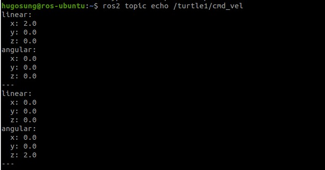

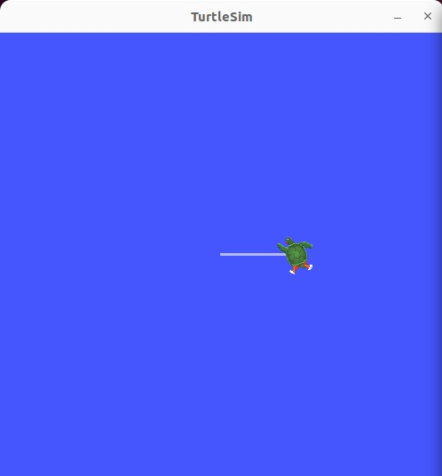

##### rqt_graph 사용

아래 명령 실행 후 Topic를 선택하고, Refresh를 누릅니다.

```bash
$ rqt_graph 
```

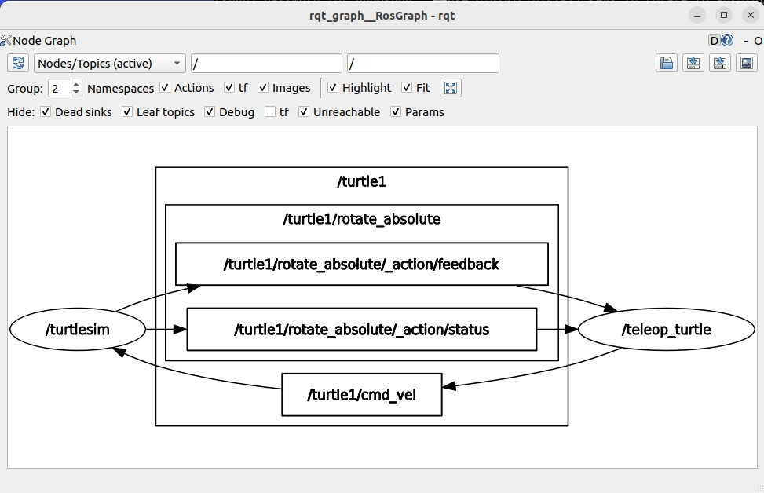

##### rqt 설치

ROS2의 상태를 확인하고 제어하는 GUI 입니다.

새 터미널에서 아래의 명령을 수행합니다.

```bash
$ sudo apt update
$ sudo apt install ros-lyrical-rqt ros-lyrical-rqt-common-plugins
```

##### rqt 실행

새로운 터미널에서 아래의 명령으로 rqt를 실행합니다.

```bash
$ source /opt/ros/lyrical/setup.bash
rqt
```

생성된 rqt에서 Plugins → Services → Service Caller 를 선택하고, 생성된 화면의 Service에서 `/spawn`을 선택하고, 아래의 내용을 입력합니다.

```
x: 2.0
y: 2.0
theta: 0.0
name: turtle2
```

이제 Call 버튼을 클릭하면,

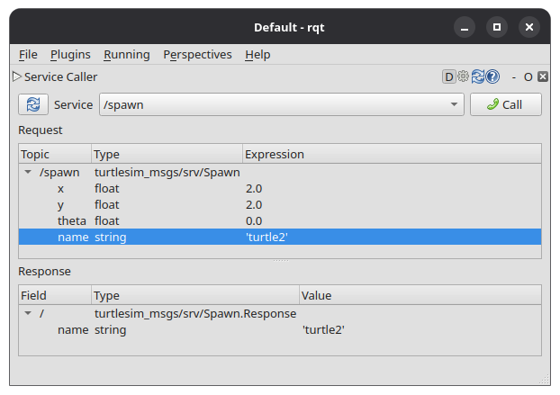

아래와 같이 turtlesim 창에 새로운 두번째 거북이가 생성됩니다.

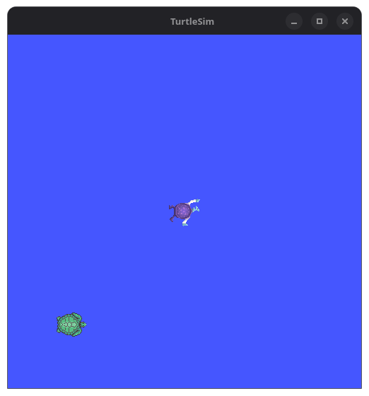

##### 거북이 삭제

Service에서 /kill 을 선택합니다. Topic 아래의 name에 'turtle2' 를 입력하고 Call을 클릭하면 새롭게 만들어졌던 두번째 거북이가 사라집니다.

##### 거북이 제어

토픽으로 거북이를 움직일 수는 없습니다.

```bash
$ ros2 run turtlesim turtle_teleop_key
```

이전에 확인했던 명령어로 키보드 움직임이 가능하고, 아래의 명령어로 직접 배포하여 동작시킬 수 있습니다.

```bash
$ ros2 topic pub --once /turtle1/cmd_vel geometry_msgs/msg/Twist \
"{linear: {x: 2.0}, angular: {z: 1.0}}"
publisher: beginning loop
publishing #1: geometry_msgs.msg.Twist(linear=geometry_msgs.msg.Vector3(x=2.0, y=0.0, z=0.0), angular=geometry_msgs.msg.Vector3(x=0.0, y=0.0, z=1.0))

```

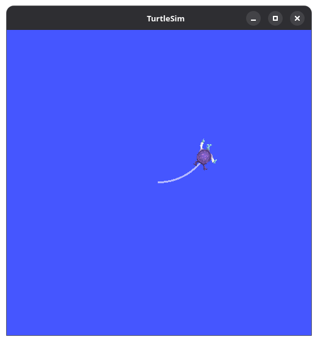

또는, 아래와 같이 명령어를 입력하고 실행하면,

```bash
$ ros2 topic pub --rate 10 /turtle1/cmd_vel geometry_msgs/msg/Twist \
"{linear: {x: 2.0}, angular: {z: 1.0}}"

```

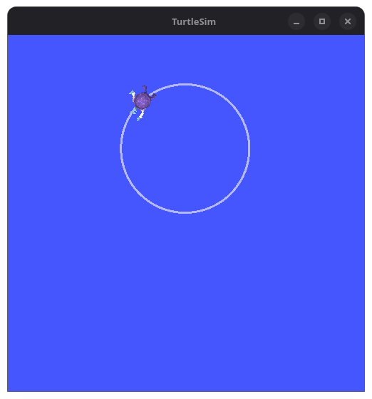

계속 원을 그리며 움직입니다.

#### ROS 명령어 기본 구조

아래의 순서대로 작성합니다.

```plaintext
$ ros2 [verb] [sub-verb] [options] [arguments]
$ ros2 [verb] -help
```

- verb : run, pkg, node, interface, topic, service, action, param, bag ...

##### ros2 run

- ros 실행명령어. TOPIC 에 관한 명령어

```plaintext
# 지정한 패키지의 노드 실행
$ ros2 run [package name] [executable node name]
# 지정한 패키지의 런치파일 실행(여러개 동시 실행 가능)
$ ros2 run [package name] [launch file name] 
```

##### ros2 pkg

- 시용가능한 패키지 검색 등의 명령

```plaintext
# 사용가능한 패키지 리스트
$ ros2 pkg list
# 지정 패키지 실행가능한 파일 리스트
$ ros2 pkg executables

# 지정 패키지의 저장위치
$ ros2 pkg prefix
# 새로운 ros2 패키지 생성
$ ros2 pkg create
# 지정 패키지 정보파일 출력
$ ros2 pkg xml
```

- 예제

```bash
$ ros2 pkg prefix turtlesim --share
/opt/ros/lyrical/share/turtlesim
$
```

##### ros2 node

- 노드관련 정보출력 명령

```plaintext
# 실행 중인 모든 노드 리스트
$ ros2 node list

# 실행 중인 노드 중 지정한 노드 정보 출력
$ ros2 node info /turtlesim
```

##### ros2 interface

- 관련 인터페이스에 대한 정보 명령어

```plaintext
# 사용가능한 패키지 리스트 출력
$ ros2 interface list

# 인터페이스 패키지들의 리스트 출력
$ ros2 interface packages

# 지정 패키지에 포함된 인터페이스 리스트출력
$ ros2 interface show

# 지정 인터페이스의 프로토타입 출력
$ ros2 interface proto
```

- 예시

```bash
$ ros2 interface package turtlesim_msgs 
turtlesim_msgs/action/RotateAbsolute
turtlesim_msgs/srv/TeleportAbsolute
turtlesim_msgs/srv/Kill
turtlesim_msgs/srv/Spawn
turtlesim_msgs/srv/SetPen
turtlesim_msgs/msg/Pose
turtlesim_msgs/srv/TeleportRelative
turtlesim_msgs/msg/Color
$ ros2 interface show geometry_msgs/msg/Twist
# This expresses velocity in free space broken into its linear and angular parts.

Vector3  linear
	float64 x
	float64 y
	float64 z
Vector3  angular
	float64 x
	float64 y
	float64 z

$ ros2 interface proto geometry_msgs/msg/Twist
"linear:
  x: 0.0
  y: 0.0
  z: 0.0
angular:
  x: 0.0
  y: 0.0
  z: 0.0
"
```

##### ros2 service list

- 사용가능한 서비스 리스트 출력

```bash
$ ros2 service list 
/clear
/kill
/reset
/spawn
/teleop_turtle/describe_parameters
/teleop_turtle/get_parameter_types
/teleop_turtle/get_parameters
/teleop_turtle/get_type_description
/teleop_turtle/list_parameters
/teleop_turtle/set_parameters
/teleop_turtle/set_parameters_atomically
/turtle1/set_pen
/turtle1/teleport_absolute
/turtle1/teleport_relative
/turtlesim/describe_parameters
/turtlesim/get_parameter_types
/turtlesim/get_parameters
/turtlesim/get_type_description
/turtlesim/list_parameters
/turtlesim/set_parameters
/turtlesim/set_parameters_atomically
```

- ros2 service list -t 까지 입력하면 서비스명과 타입까지 출력

##### ros2 service call

- 서비스 호출 명령
- 예시

```bash
# 지금까지의 이동 궤적을 지우고 클리어
$ ros2 service call /clear std_srvs/srv/Empty

```

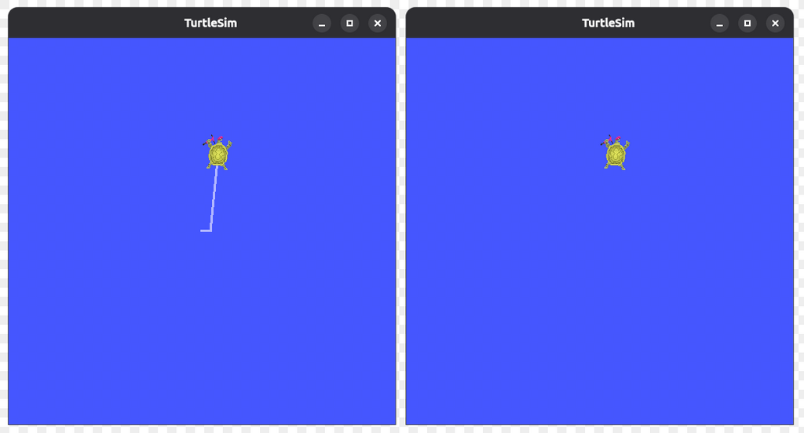

```bash
$ ros2 service call /kill turtlesim/srv/Kill "name: 'turtle1'"
```

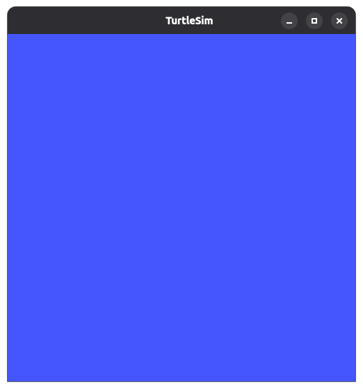

```bash
$ ross service call /reset std_srv/srv/Empty
```

- 다른 거북이가 초기화 되어 생성됨

```bash
$ ros2 service call /spawn turtlesim/srv/Spawn "{x:5.5, y:9.3, theta:1.57, name: 'turtle2'}"
```

- 새로운 거북이 생성

```bash
$ ros2 service call /turtle1/set_pen turtlesim/srv/SetPen "{r:255, g:255, b:255, width:10}"
```

- 펜스타일 변경

##### ros2 action list

- 액션 명령어 -t 도 존재

```bash
$ ros2 action list
$ ros2 action info /turtle1/rotate_absolute
```

- 지정 액션의 액션 목표를 전송하는 명령

```bash
$ ros2 action send_goal /turtle1/rotate_absolute turtlesim/action/RotateAbsolute "theta: 1.5708"
Waiting for an action server to become available...
Sending goal:
     theta: 1.5708

Goal accepted with ID: df8b9996d6554cf496075c91984db0ea

Result:
    delta: -1.5520000457763672

Goal finished with status: SUCCEEDED

```

- 1.57 은 반시계방향으로 90도 회전한 것임
- --feedback  옵션으로 자세한 설명 확인

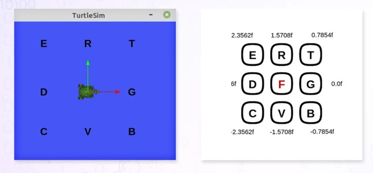

- teleop_key 설명

#### ros2 param list

- 파라미터 명령어
- 파라미터 목록 확인으로 형태, 목적, 데이터 형태, 최소/최대값 확인 가능

```bash
$ ros2 param describe /turtlesim background_b 
Parameter name: background_b
  Type: integer
  Description: Blue channel of the background color
  Constraints:
    Min value: 0
    Max value: 255
    Step: 1

```

- 파라미터값 읽어오기

```bash
$ ros2 param get /turtlesim background_r
Integer value is: 69
$ ros2 param get /turtlesim background_g
Integer value is: 86
$ ros2 param get /turtlesim background_b
Integer value is: 255
```

- 파라미터값 변경

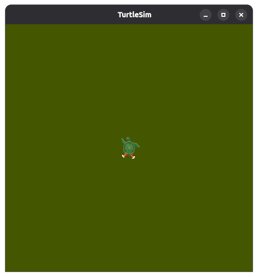

```bash
$ ros2 param set /turtlesim background_b 0
```

- 파라미터값 저장, yaml 포맷

```bash
$ ros2 param dump [node_name]
```

- 파라미터로 로드 시작하기

```bash
$ ros2 run turtlesim turtlesim_node --ros_args_params -file./turtlesim.yaml
```

#### 메시지 통신

- 노드 : 실행 가능한 최소 단위의 프로세스
- 최소한의 실행 단위 노드 기준으로 프로그램을 나누어 작업하는 것이 핵심

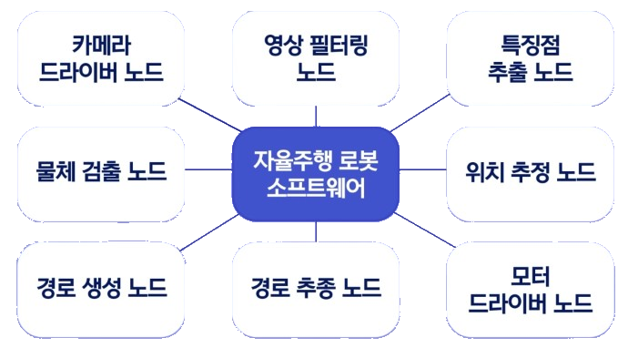

위와 같이 노드를 나눠서 목적에 맞게 세분화 작업하면 여러 작업을 나눌때 효율적, 노드 재사용성 등

- 메시지 : 노드들 간에 주고받는 데이터
- 메시지 통신 : 주고받는 방식
- 형태 : integer, floating point, boolean, string
- 구조 : 간단한 데이터 구조 나 메시지들의 배열로 구성
- 메시지 방식 : 토픽, 서비스, 액션, 파라미터

##### 토픽

- 비동기 단방향 메시지 송수신 방식
- msg 형태의 메시지를 Pubilsher, 메시지 구독 Subscriber 간의 통신으로 구성
- 1:N, N:1, N:M 통신 가능
- ROS 메시지 통신 중 가장 기본
- 센서값 전송 등 계속 정보를 주고받아야 하는 부분에 사용

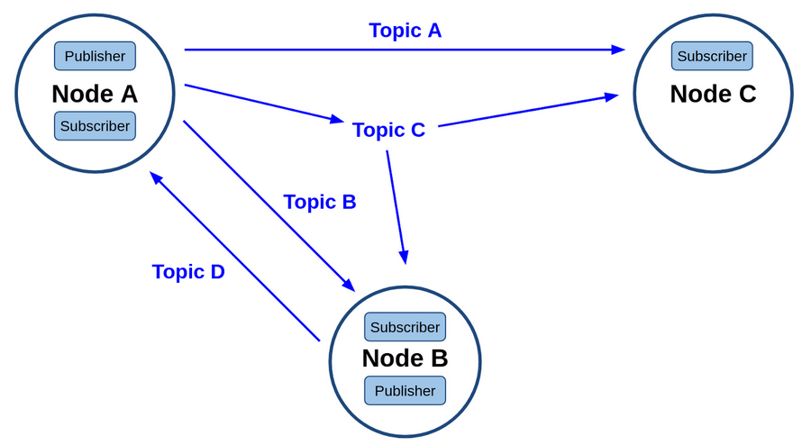

##### 서비스

- 동기식 양방향 메시지 송수신 방식
- 특정 요청을 하는 클라이언트와 요청 받은 일을 수행 후에 결과값을 전달하는 서버간의 통신
- 동일 서비스 서버에 대해 복수의 클라이언트를 가질 수 있게 설계
- 서비스 응답은 서비스 요청이 있었던 서비스 클라이언트에 대해서만 응답
- srv 메시지로 서비스 요청과 응답

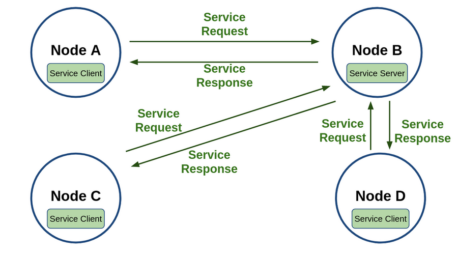

##### 액션

- 비동기 및 동기식 양방향 서비스 송수신 방식
- Action Client와 액션 목표를 받아 특정 태스크를 수행, 액션 피드백과 액션 결과 Result를 전송하는 Action Server 간 통신
- Action 메시지, Action Goal, Feedback, Result 구성

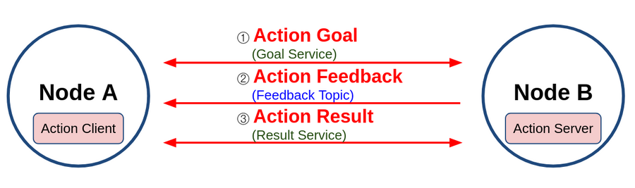

##### 파라미터

- 각 노드에 파라미터 관련 Parameter Server를 실행, 외부의 Parameter Client 간의 통신으로 파라미터를 변경
- 노드 내 매개변수 또는 글로벌 매개변수를 서비스 메시지 통신 방법으로 사용하는 것
- 모든 노드가 자신만의 Parameter Server를 포함, 각 노드는 Parameter 클라이언트도 포함
- yaml 포맷의 설정파일을 만들고 노드 실행 시 불러와서 사용 가능

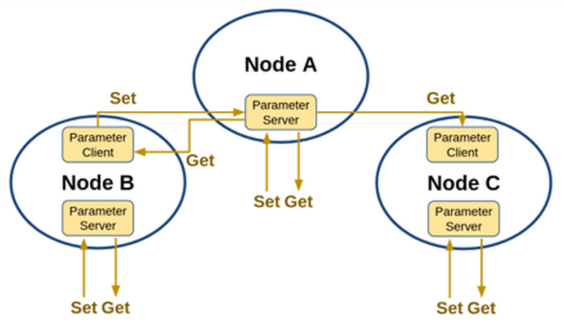

##### 전체 구성도

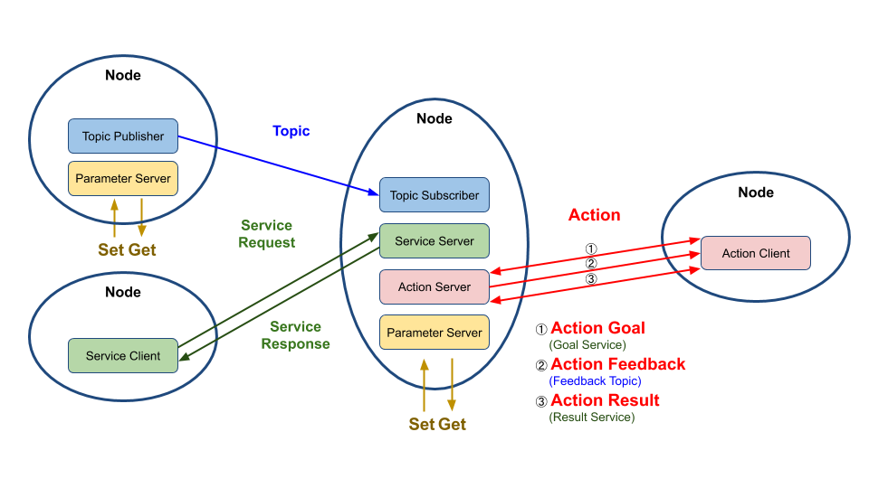

#### 비교표

- 기본 비교


| 구분            | 토픽(Topic)                         | 서비스(Service)                          | 액션(Action)                             |
| --------------- | ----------------------------------- | ---------------------------------------- | ---------------------------------------- |
| **연속성**      | 연속적인 데이터 전달                | 한 번 요청하고 한 번 응답                | 장시간 작업을 수행하며 중간 결과 전달    |
| **방향성**      | 단방향                              | 양방향: 요청 → 응답                     | 양방향: 목표 → 피드백 → 결과           |
| **동기성**      | 비동기                              | 주로 동기적 요청·응답비동기 호출도 가능 | 비동기                                   |
| **다자간 연결** | 다대다 가능                         | 일반적으로 다수 클라이언트와 하나의 서버 | 일반적으로 다수 클라이언트와 하나의 서버 |
| **노드 역할** | Publisher / Subscriber              | Service Server / Client                  | Action Server / Client                   |
| **동작 트리거** | Publisher가 메시지를 발행할 때      | Client가 요청할 때                       | Client가 목표(Goal)를 전송할 때          |
| **인터페이스**  | `.msg`                              | `.srv`                                   | `.action`                                |
| **CLI 명령어**  | `ros2 topic`                        | `ros2 service`                           | `ros2 action`                            |
| **사용 예**     | 센서값, 카메라 영상, 로봇 속도 명령 | 거북이 생성, 설정 변경, 간단한 계산      | 목적지 이동, 로봇팔 작업, 내비게이션     |

- 핵심 구조


| 방식   | 데이터 흐름                                              |
| ------ | -------------------------------------------------------- |
| 토픽   | Publisher → 메시지 → Subscriber                        |
| 서비스 | Client → 요청 → Server → 응답 → Client               |
| 액션   | Client → Goal → Server → Feedback → Result → Client |

- 인터페이스 비교


| 구분        | 메시지 인터페이스    | 서비스 인터페이스                | 액션 인터페이스                                      |
| ----------- | -------------------- | -------------------------------- | ---------------------------------------------------- |
| **확장자**  | `.msg`               | `.srv`                           | `.action`                                            |
| **데이터**  | 전달할 메시지 데이터 | 요청 데이터 + 응답 데이터        | 목표 + 결과 + 중간 피드백                            |
| **형식**    | 하나의 필드 영역     | Request<br />`---`<br />Response | Goal<br />`---`<br />Result<br />`---`<br />Feedback |
| **사용 예** | 센서값, 위치, 속도   | 두 수 계산, 설정 변경            | 목적지 이동, 로봇팔 제어                             |

- msg 예시 - Person.msg

```plaintext
string name
int32 age
```

- srv 예시 - AddTwoInts.srv

```plaintext
int64 a
int64 b
---
int64 sum
```

- action 예시 - Navigate.action

```plaintext
# Goal
float64 target_x
float64 target_y
---
# Result
bool success
---
# Feedback
float64 remaining_distance
```
