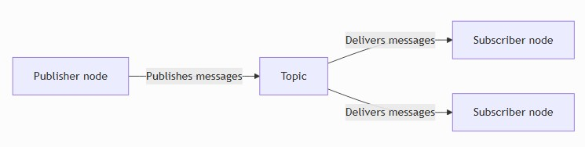
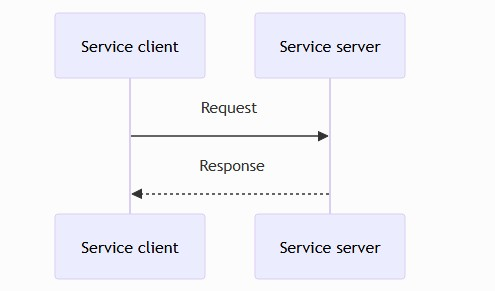

# ROS2 튜토리얼

## ROS2 이론 학습

### 인터페이스(토픽, 서비스, 액션)

ROS에서 인터페이스는 노드 간 데이터 교환 방식을 정의합니다. ROS 노드는 일반적으로 다음 세 가지 유형의 인터페이스를 통해 통신합니다.

- Topics : 연속 데이터 스트림용
- Services : 동기식 요청/응답 상호 작용(즉시 처리되는 간단한 작업)에 사용
- Actions : 피드백이 필요한 장기 작업(완료하는 데 시간이 걸릴 수 있는 작업)에 사용

일관된 통신을 위해 각 인터페이스는 `.msg`, `.srv`, 또는 `.action`파일에 제공된 정의를 사용합니다.

### 토픽(Topic)

토픽 인터페이스는 연속적인 데이터 스트림, 예를 들어 스트리밍 센서 데이터나 로봇의 상태 등을 처리하기 위한 것입니다. 토픽 정의는 `.msg`파일에 저장됩니다.

토픽은 발행/구독 패턴을 구현합니다. `노드`는 토픽에 데이터를 발행하고, 다른 노드들은 해당 데이터를 수신하기 위해 구독합니다. 아래와 같은 특징을 가지고 있습니다.

- 비동기식 단방향 통신
- 여러 게시자와 구독자가 동일한 주제를 공유 가능



토픽 키는 토픽에 대한 개별 게시자를 식별하여 노드와 도구가 메시지의 출처를 구분할 수 있도록 합니다. 각 토픽 키를 사용하면 여러 게시자가 동일한 토픽을 공유하는 경우 데이터 소스를 추적하기가 더 쉬워집니다.

#### 메시지

메시지는 ROS 2 노드가 네트워크를 통해 다른 ROS 노드로 데이터를 전송하는 방법이며, 응답을 요구하지 않습니다.

ROS 2 노드가 센서에서 온도 데이터를 읽으면 해당 데이터를 메시지를 사용하여 ROS 2 네트워크에 `Temperature` 를 게시할 수 있습니다 . ROS 2 네트워크의 다른 노드는 해당 데이터를 구독하고 `Temperature`메시지를 수신할 수 있습니다.

메시지는 ROS 패키지 디렉터리 `.msg`에 있는 파일 에 설명 및 정의되어 있습니다 . 파일은 필드와 상수의 두 부분으로 구성됩니다.

#### 필드 정의

```plaintext
fieldtype1 fieldname1
fieldtype2 fieldname2
fieldtype3 fieldname3
```

#### 필드 유형


| Type name | [C++](https://design.ros2.org/articles/generated_interfaces_cpp.html) | [Python](https://design.ros2.org/articles/generated_interfaces_python.html) | [DDS type](https://design.ros2.org/articles/mapping_dds_types.html) |
| --------- | --------------------------------------------------------------------- | --------------------------------------------------------------------------- | ------------------------------------------------------------------- |
| bool      | bool                                                                  | builtins.bool                                                               | boolean                                                             |
| byte      | uint8\_t                                                              | builtins.bytes\*                                                            | octet                                                               |
| char      | char                                                                  | builtins.int\*                                                              | char                                                                |
| float32   | float                                                                 | builtins.float\*                                                            | float                                                               |
| float64   | double                                                                | builtins.float\*                                                            | double                                                              |
| int8      | int8\_t                                                               | builtins.int\*                                                              | octet                                                               |
| uint8     | uint8\_t                                                              | builtins.int\*                                                              | octet                                                               |
| int16     | int16\_t                                                              | builtins.int\*                                                              | short                                                               |
| uint16    | uint16\_t                                                             | builtins.int\*                                                              | unsigned short                                                      |
| int32     | int32\_t                                                              | builtins.int\*                                                              | long                                                                |
| uint32    | uint32\_t                                                             | builtins.int\*                                                              | unsigned long                                                       |
| int64     | int64\_t                                                              | builtins.int\*                                                              | long long                                                           |
| uint64    | uint64\_t                                                             | builtins.int\*                                                              | unsigned long long                                                  |
| string    | std::string                                                           | builtins.str                                                                | string                                                              |
| wstring   | std::u16string                                                        | builtins.str                                                                | wstring                                                             |

모든 내장 타입은 배열을 정의하는 데 사용할 수 있습니다.


| Type name               | [C++](https://design.ros2.org/articles/generated_interfaces_cpp.html) | [Python](https://design.ros2.org/articles/generated_interfaces_python.html) | [DDS type](https://design.ros2.org/articles/mapping_dds_types.html) |
| ----------------------- | --------------------------------------------------------------------- | --------------------------------------------------------------------------- | ------------------------------------------------------------------- |
| static array            | std::array<T, N>                                                      | builtins.list\*                                                             | T[N]                                                                |
| unbounded dynamic array | std::vector                                                           | builtins.list                                                               | sequence                                                            |
| bounded dynamic array   | custom\_class<T, N>                                                   | builtins.list\*                                                             | sequence<T, N>                                                      |
| bounded string          | std::string                                                           | builtins.str\*                                                              | string                                                              |

배열과 제한된 타입을 사용한 메시지 정의 예시

```plaintext
int32[] unbounded_integer_array
int32[5] five_integers_array
int32[<=5] up_to_five_integers_array

string string_of_unbounded_size
string<=10 up_to_ten_characters_string

string[<=5] up_to_five_unbounded_strings
string<=10[] unbounded_array_of_strings_up_to_ten_characters_each
string<=10[<=5] up_to_five_strings_up_to_ten_characters_each
```

#### 필드 제약사항

필드 이름은 소문자 영숫자로만 구성되어야 하며, 단어 사이에는 밑줄을 사용할 수 있습니다. 또한, 필드 이름은 반드시 알파벳으로 시작해야 하며, 밑줄로 끝나거나 연속된 두 개의 밑줄을 사용할 수 없습니다.

#### 필드 기본값

메시지 유형의 모든 필드에 기본값을 설정할 수 있습니다. 현재 문자열 배열 및 복합 유형(즉, 위의 기본 유형 표에 없는 유형, 모든 중첩 메시지에 적용됨)에 대해서는 기본값 설정이 지원되지 않습니다.

기본값을 정의하려면 필드 정의 줄에 세 번째 요소를 추가하면 됩니다.

```plaintext
uint8 x 42
int16 y -2000
string full_name "John Doe"
int32[] samples [-200, -100, 0, 100, 200]
```

#### 상수

각 상수 정의는 기본값이 있는 필드 설명과 유사하지만, 이 기본값은 프로그램적으로 변경할 수 없습니다. 이 값 할당은 등호 '='를 사용하여 나타냅니다. 상수 이름은 반드시 대문자여야 합니다.

```plaintext
int32 X=123
int32 Y=-123
string FOO="foo"
string EXAMPLE='bar'
```

### Topic statistics

토픽 통계는 구독자가 메시지를 수신할 때 메시지 동작 방식을 파악하는 데 도움이 되는 내장 측정 기능입니다. 활성화되면 다음 두가지를 자동으로 추적합니다.

- Message Age: 메시지가 도착했을 때의 타임스탬프를 기준으로 해당 메시지가 얼마나 오래되었는지 파악
- Message Period: 수신 메시지 사이의 시간 간격

ROS는 메시지 경과 시간과 기간 모두에 대해 평균, 최소값, 최대값, 표준 편차 및 샘플 수를 계산합니다. 이러한 계산은 전용 유틸리티를 사용하여 상수 시간 및 메모리 용량으로 실행됩니다. 수집된 데이터를 정기적으로 `MetricsMessage`통계 토픽에 게시합니다.

이를 통해 타이밍 패턴, 지연 및 불규칙성을 명확하게 파악할 수 있으므로 시스템 성능을 평가하거나 메시지 흐름과 관련된 문제를 진단하는 것이 더 쉬워집니다.

기본 간격은 1초입니다. 기본 통계 토픽은  `/statistics` 입니다.

### 서비스(Services)

서비스 인터페이스는 동기식 요청/응답 상호 작용을 위해 설계되었습니다.

특정 로봇의 구성을 요청하는 쿼리를 보낼 때 사용됩니다. 서비스 정의는 `.srv`파일에 저장됩니다. 서비스는 요청/응답 패턴을 구현합니다.

클라이언트가 요청을 보내면 서버가 응답을 보냅니다. 이 인터페이스 유형은 다음과 같은 주요 특징을 가지고 있습니다.

* 동기식 통신
* 확인이 필요하거나 요청에 대한 결과를 제공해야 하는 단기 작업에 이상적입니다.



서비스 설명 파일은 쉼표(,)로 구분된 요청 메시지 유형과 응답 메시지 유형으로 구성됩니다 . 쉼표(,)로 연결된 `---`두 파일은 모두 유효한 서비스 설명 파일입니다.

문자열을 입력받아 문자열을 반환하는 매우 간단한 서비스의 예입니다.

```plaintext
string str
---
string str
```

복잡한 예시입니다.

```plaintext
# 상수 요청
int8 FOO=1
int8 BAR=2
# 필드 요청
int8 foobar
another_pkg/AnotherMessage msg
---
# 상수 응답
uint32 SECRET=123456
# 필드 응답
another_pkg/YetAnotherMessage val
CustomMessageDefinedInThisPackage value
uint32 an_integer
```

### 액션(Actions)

액션 인터페이스는 피드백이 필요한 장시간 실행 작업, 예를 들어 로봇을 특정 위치로 이동시키거나 복잡한 동작을 수행하도록 요청하는 작업에 사용됩니다. 액션 정의는 `.action`파일에 저장됩니다.

클라이언트는 액션을 통해 목표를 전송하고, 실행 중에 피드백을 받고, 필요한 경우 취소하고, 결과가 있으면 반환할 수 있습니다. 이 인터페이스 유형은 다음과 같은 주요 특징을 가지고 있습니다.

* 피드백 및 결과 포함 비동기 방식
* 시간이 오래 걸리는 작업에 적합

서비스와 마찬가지로 요청 필드는 첫 번째 세 개의 대시(- `---`) 앞에, 응답 필드는 뒤에 각각 위치합니다. 두 번째 세 개의 대시 뒤에는 피드백을 보낼 때 전송해야 하는 필드들이 포함된 세 번째 필드 세트가 있습니다.

#### 액션 형식

```plaintext
<request_type> <request_fieldname>
---
<response_type> <response_fieldname>
---
<feedback_type> <feedback_fieldname>
```

`Fibonacci`액션 정의에는 다음 내용이 포함됩니다.

```plaintext
int32 order
---
int32[] sequence
---
int32[] sequence
```

이는 액션 클라이언트가 `int32`피보나치 수열 단계 수를 나타내는 단일 필드를 전송하고, 액션 서버가 `int32`모든 단계를 담은 배열을 생성할 것으로 예상하는 액션 정의입니다. 액션 서버는 도중에 `int32`특정 시점까지 완료된 단계를 담은 중간 배열을 제공할 수도 있습니다.

#### 인터페이스 별 비교


| 구분   | 통신 형태            | 특징                          | 적합한 사례                    |
| ------ | -------------------- | ----------------------------- | ------------------------------ |
| 토픽   | 지속적인 단방향      | 발행자가 계속 전송, 응답 없음 | 센서값, 카메라 영상, 속도 명령 |
| 서비스 | 1회 요청 → 1회 응답 | 결과가 나올 때까지 기다림     | 설정 변경, 현재 상태 조회      |
| 액션   | 장시간 목표 수행     | 진행률 제공, 취소 가능        | 목적지 이동, 로봇팔 작업       |

### 노드(Node)

노드는 ROS 2 그래프의 참여자이며, 클라이언트 라이브러리를 사용하여 다른 노드와 통신합니다.

노드는 명명된 토픽에 데이터를 게시하여 다른 노드에 전달하거나, 명명된 토픽을 구독하여 다른 노드로부터 데이터를 가져올 수 있습니다.

다른 노드가 자신을 대신하여 연산을 수행하도록 하는 서비스 클라이언트 역할을 하거나, 다른 노드에 기능을 제공하는 서비스 서버 역할을 할 수도 있습니다.

장시간 소요되는 연산의 경우, 노드는 다른 노드가 자신을 대신하여 연산을 수행하도록 하는 액션 클라이언트 역할을 하거나, 다른 노드에 기능을 제공하는 액션 서버 역할을 할 수 있습니다.

노드는 런타임 중에 동작을 변경할 수 있는 구성 가능한 매개변수를 제공할 수 있습니다 .

종종 게시자, 구독자, 서비스 서버, 서비스 클라이언트, 액션 서버 및 액션 클라이언트가 모두 동시에 복잡하게 조합된 형태를 띨 수 있고, 노드간 연결을 분산형 검색 프로세스를 통해서 설정합니다.

### Discovery

노드 검색은 ROS 2의 기본 미들웨어를 통해 자동으로 이루어집니다. 이를 요약하면 다음과 같습니다.

1. 노드가 시작되면 동일한 ROS 도메인(ROS_DOMAIN_ID 환경 변수로 설정)을 가진 네트워크의 다른 노드들에게 자신의 존재를 알립니다. 노드들은 이 알림에 대한 응답으로 자신에 대한 정보를 제공하여 적절한 연결을 설정하고 서로 통신할 수 있도록 합니다.
2. 노드는 주기적으로 자신의 존재를 알림으로써 초기 발견 기간 이후에도 새롭게 발견된 개체와 연결을 맺을 수 있도록 합니다.
3. 노드는 오프라인 상태가 될 때 다른 노드에 알립니다.

이전의 [토커/리스너 예제](./ROS2_2.md#ros-테스트)를 상기해 보시기 바랍니다. 한 터미널에서 C++ 토커 노드를 실행하면 특정 토픽에 메시지를 게시하고, 다른 터미널에서 실행되는 Python 리스너 노드는 동일한 토픽의 메시지를 구독합니다.

이러한 노드들이 자동으로 서로를 발견하고 메시지 교환을 시작하는 것을 확인할 수 있습니다.

### 매개변수

ROS 2의 파라미터는 개별 노드와 연결됩니다. 파라미터는 코드 변경 없이 노드 시작 시(및 런타임 중) 노드를 구성하는 데 사용됩니다. 파라미터의 수명은 노드의 수명과 동일합니다.

매개변수는 노드 이름, 노드 네임스페이스, 매개변수 이름, 매개변수 네임스페이스 순으로 참조됩니다. 매개변수 네임스페이스 제공은 선택 사항입니다.

각 매개변수는 키, 값 및 설명자로 구성됩니다. 키는 문자열이고 값은 다음 유형 중 하나입니다: `bool`, `int64`, `float64`, `string`, `byte[]`, `bool[]`, `int64[]`, `float64[]` 또는 `string[]`.

기본적으로 모든 설명자는 비어 있지만 매개변수 설명, 값 범위, 유형 정보 및 추가 제약 조건을 포함할 수 있습니다.

[매개변수 따라하기 예제](./ROS2_Practice.md#매개변수-따라하기) 를 확인하세요.
