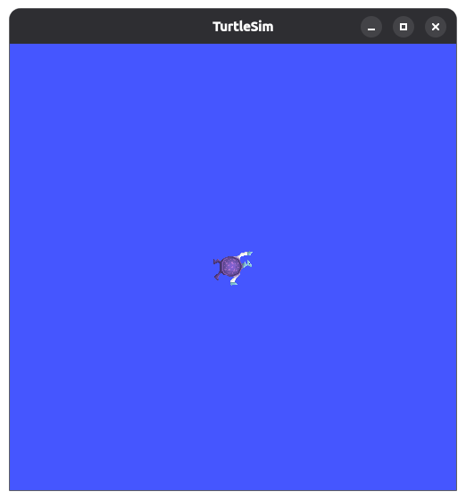

# ROS2 튜토리얼

## 노드와 메시지 통신

노드와 메시지 통신은 ROS의 핵심요소입니다.

### ROS2 토픽

- 실행 중인 노드가 없는 상황에서 터미널에서 아래의 명령어를 실행합니다.

```bash
$ ros2 topic list
/parameter_events
/rosout
```

- parameter_events : parameter 서버 기능으로 parameter 값을 저장하고 관리하는 특수 토픽
- rosout : 시스템 전체의 정보, 디버그, 경고, 오류 등의 로그 메시지를 관리하는 특수 토픽
- turtlesim 노드를 실행한 뒤 다시 해봅니다.

```bash
$ ros2 run turtlesim turtlesim_node 
[INFO] [1787809692.456261701] [turtlesim]: Starting turtlesim with node name /turtlesim
[INFO] [1787809692.468624555] [turtlesim]: Spawning turtle [turtle1] at x=[5.544445], y=[5.544445], theta=[0.000000]
```



- 터틀심이 실행되었습니다.

```bash
$ ros2 topic list
/parameter_events
/rosout
/turtle1/cmd_vel
/turtle1/color_sensor
/turtle1/pose

$ ros2 topic list -
-c                       -s                       --use-sim-time
--count-topics           --show-types             -v
--include-hidden-topics  --spin-time              --verbose
--no-daemon              -t   

$ ros2 topic list -t 
.bash_history
.bash_logout
.bashrc
.cache/
.config/
Desktop/
...
```


| 옵션                      | 의미                                                          |
| ------------------------- | ------------------------------------------------------------- |
| `-t`,`--show-types`       | 토픽 이름과 메시지 타입을 함께 표시                           |
| `-v`,`--verbose`          | 토픽 타입뿐 아니라 Publisher·Subscriber 정보까지 자세히 표시 |
| `-c`,`--count-topics`     | 검색된 토픽의 총개수 표시                                     |
| `--include-hidden-topics` | 숨김 토픽까지 포함해 표시. 이름 일부가`_`로 시작하는 토픽     |
| `--no-daemon`             | ROS 2 daemon을 사용하지 않고 직접 노드를 검색                 |
| `-s`,`--spin-time`        | 노드와 토픽을 검색하기 위해 기다릴 시간(초) 지정              |
| `--use-sim-time`          | 시스템 시간 대신 시뮬레이션의`/clock`시간 사용                |

- 노드 정보도 확인해 봅니다.

```bash
$ ros2 node info /turtlesim 
/turtlesim
  Subscribers:
    /parameter_events: rcl_interfaces/msg/ParameterEvent
    /turtle1/cmd_vel: geometry_msgs/msg/Twist
  Publishers:
    /parameter_events: rcl_interfaces/msg/ParameterEvent
    /rosout: rcl_interfaces/msg/Log
    /turtle1/color_sensor: turtlesim_msgs/msg/Color
    /turtle1/pose: turtlesim_msgs/msg/Pose
  Service Servers:
    /clear: std_srvs/srv/Empty
    /kill: turtlesim_msgs/srv/Kill
    /reset: std_srvs/srv/Empty
    /spawn: turtlesim_msgs/srv/Spawn
    /turtle1/set_pen: turtlesim_msgs/srv/SetPen
    /turtle1/teleport_absolute: turtlesim_msgs/srv/TeleportAbsolute
    /turtle1/teleport_relative: turtlesim_msgs/srv/TeleportRelative
    /turtlesim/describe_parameters: rcl_interfaces/srv/DescribeParameters
    /turtlesim/get_parameter_types: rcl_interfaces/srv/GetParameterTypes
    /turtlesim/get_parameters: rcl_interfaces/srv/GetParameters
    /turtlesim/get_type_description: type_description_interfaces/srv/GetTypeDescription
    /turtlesim/list_parameters: rcl_interfaces/srv/ListParameters
    /turtlesim/set_parameters: rcl_interfaces/srv/SetParameters
    /turtlesim/set_parameters_atomically: rcl_interfaces/srv/SetParametersAtomically
  Service Clients:

  Action Servers:
    /turtle1/rotate_absolute: turtlesim_msgs/action/RotateAbsolute
  Action Clients:

```

- 아래의 명령은 해당 토픽의 정보를 출력하는 명령으로 배포하는 노드와 구독하는 노드의 갯수를 출력합니다

```bash
$ ros2 topic info /turtle1/cmd_vel 
Type: geometry_msgs/msg/Twist
Publisher count: 0
Subscription count: 1

```

- 가장 많이 활용될 명령어로 토픽에서의 메시지를 실시간 출력하는 명령입니다.

```bash
$ ros2 topic echo /turtle1/cmd_vel
```

#### 노드 간의 통신

- 노드 간의 통신이 필요합니다. 현재는 turtlesim_node 만 실행했습니다. 이 노드는 Subscription 노드입니다. 따라서 Publisher 가 있어야 합니다.

```bash
$ ros2 run turtlesim turtle_teleop_key 

```

위의 명령어가 Publisher 노드 생성입니다. 이러면 이제 echo 중이던 토픽에서 메시지가 출력됩니다.

```bash
$ ros2 topic echo /turtle1/cmd_vel 
linear:
  x: 2.0
  y: 0.0
  z: 0.0
angular:
  x: 0.0
  y: 0.0
  z: 0.0
---
linear:
  x: 0.0
  y: 0.0
  z: 0.0
angular:
  x: 0.0
  y: 0.0
  z: -2.0
---

```


앞서 봤던 명령어를 확인합니다.

```bash
$ ros2 topic pub --once /turtle1/cmd_vel geometry_msgs/msg/Twist "{linear: {x: 2.0}, angular: {z: 1.0}}"
```

위 명령어의 뜻은 선속도(linear) x 방향으로 2.0, 각속도(angular) 반시계 방향으로 1.0rad/s 로 입력하여 토픽을 한번만 Publish 하라는 의미입니다.

```bash
$ ros2 topic pub --rate 10 /turtle1/cmd_vel geometry_msgs/msg/Twist "{linear: {x: 2.0}, angular: {z: 1.0}}"
```

위 명령은 동일한 명령을 초당 10회, 10Hz로 반복 발행하라는 뜻입니다.


```bash
$ ros2 topic hz /turtle1/cmd_vel 
average rate: 2.625
	min: 0.192s max: 0.611s std dev: 0.15444s window: 4
average rate: 1.636
	min: 0.189s max: 2.234s std dev: 0.67593s window: 7
average rate: 1.718
	min: 0.189s max: 2.234s std dev: 0.63697s window: 8

$ ros2 topic bw /turtle1/cmd_vel 
Subscribed to [/turtle1/cmd_vel]
192 B/s from 2 messages
	Message size mean: 52 B min: 52 B max: 52 B
135 B/s from 4 messages
	Message size mean: 52 B min: 52 B max: 52 B
102 B/s from 5 messages
	Message size mean: 52 B min: 52 B max: 52 B

```

위는 토픽의 평균 발행주기와 대역폭(송수신 메시지 크기) 를 확인할 수 있습니다.

- ros2 topic type /turtle1/cmd_vel : 메시지 형태 확인
- ros2 topic find geometry_msgs/msg/Twist : 메시지를 사용하는 토픽을 검색


### ROS2 서비스
