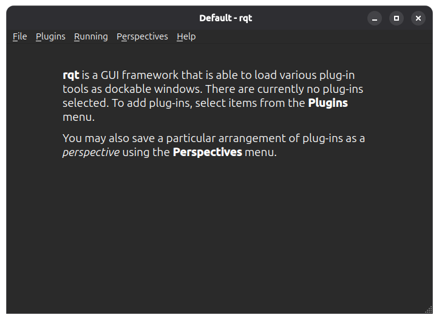
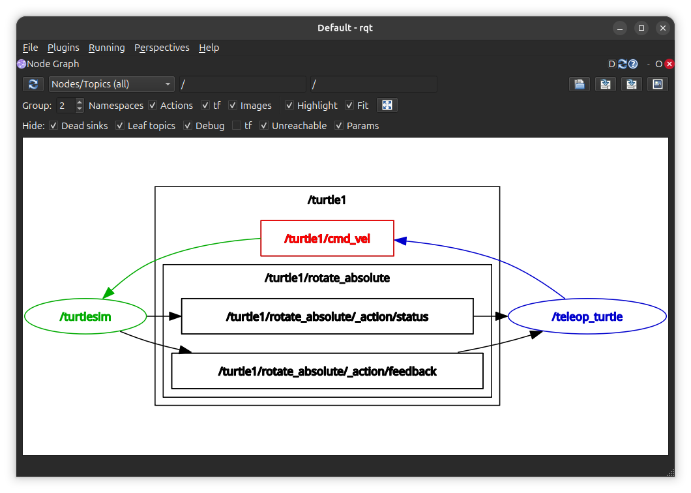
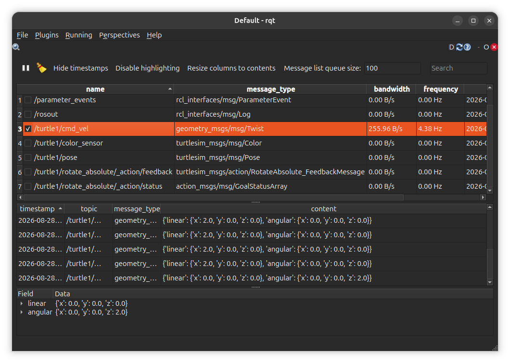
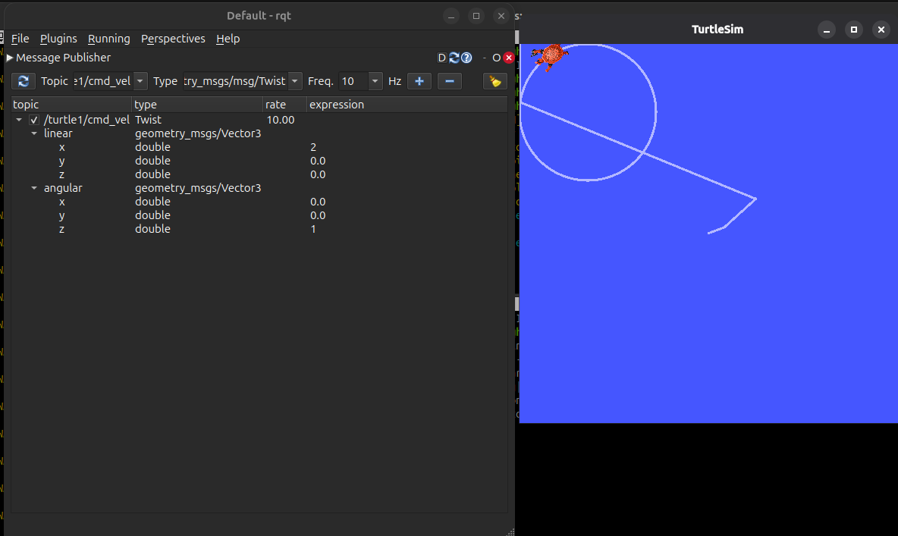
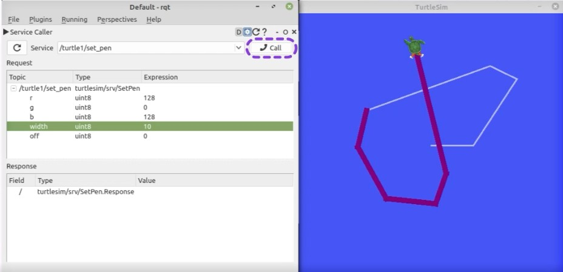
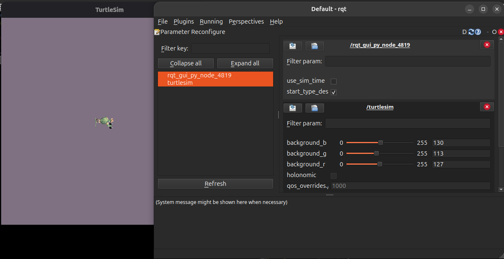
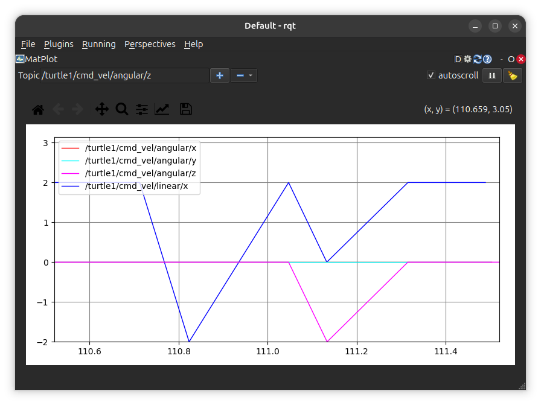
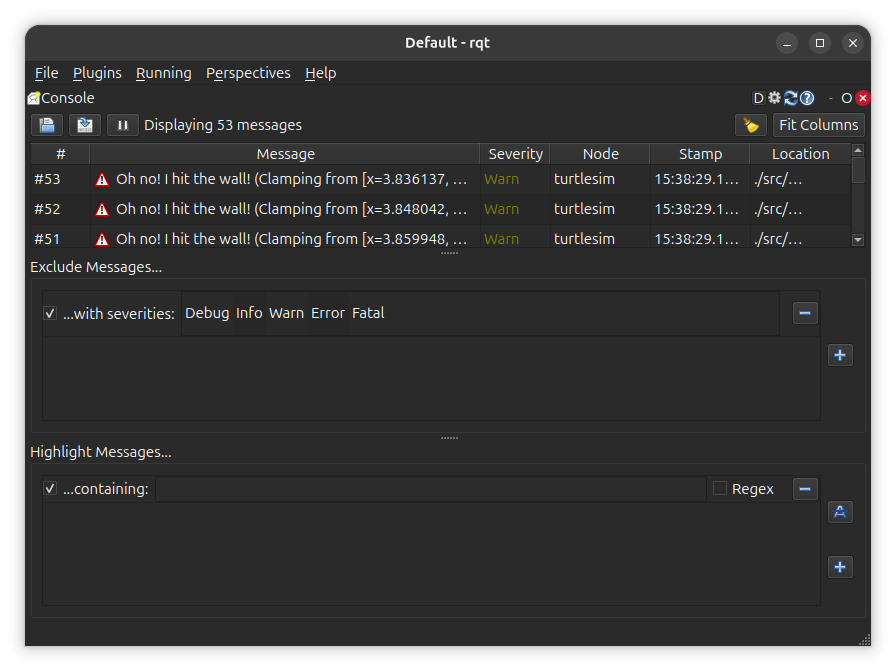
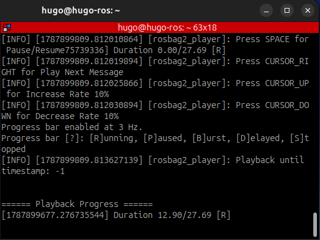
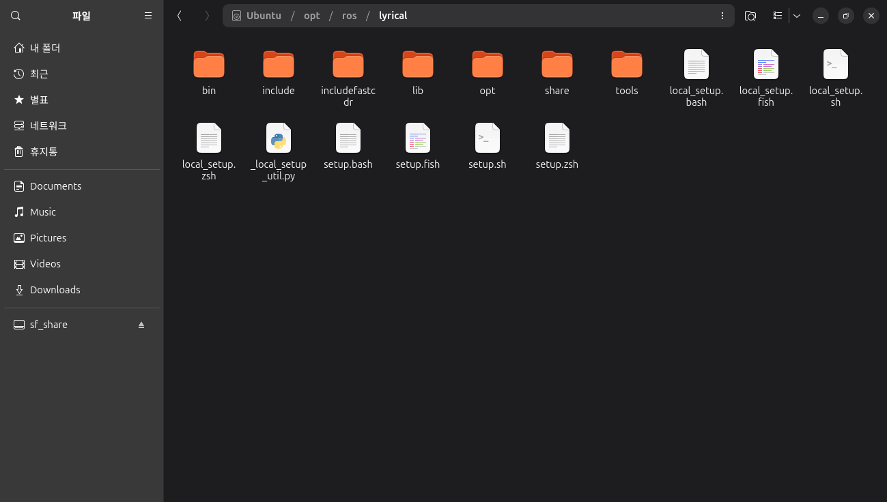

# ROS2 튜토리얼

## ROS2 GUI

ROS2 에서 자주 사용되는 GUI 툴

### GUI 툴 리스트

- CLI
- RQt GUI
- 3차원 시각화 툴 Rviz
- 3차원 시뮬레이터 Gazebo

#### CLI

- 터미널 명령어로 실행하는 방법

#### RQt

- GUI 형태의 Qt 기반 ROS 사용툴
- ROS2 설치시 기본 설치됨

```bash
$ sudo apt install ros-lyrical-rqt*
```

##### 실행방법

```bash
$ rqt
```



여기에서 원하는 메뉴를 클릭해서 진행

#### RQt 플러그인

##### Node Graph

- 현재 개발환경에서 실행한 노드들의 관게를 그래프 형태로 표시하는  RQt 플러그인



##### Topic Monitor



##### Message Publisher

- 특정 토픽 이름으로 특정 타입의 토픽을 발행하는 토픽 퍼블리셔 역할\



##### Messagae Type Browsers

- 특정 토픽의 타입을 확인하는 플러그인

##### Service Caller

- 실행 중인 서비스에 접속, 서비스를 요청하는 플러그인



##### Dynamic Reconfigure

- 노드에서 제공하는 파라미터값을 확인하고 변경하는 플러그인



##### Plot

2차원 데이터 플롯 기능 플러그인



##### Console

- 노드에서 발생하는 정보, 경로, 에러 등을 확인할 수 있는 플러그인



#### RQt 사용 팁

- 로스백

```bash
# ROS 노드 실행 후
# ROS 텔레오퍼레이션 실행
# 레코드 전부 실행
$ ros2 bag record -all
# 로스백 저장 확인
$ ros2 bag info rosbag2_2026_08_28-15_47_44/
# 로스백 플레이
$ ros2 bag play rosbag2_...
# 에코로 확인
$ ros2 topic echo /turtle1/cmd_vel
# 원하는 파일명과 토픽으로 로스백 저장
$ ros2 bag record -o saveTopic /turtle1/cmd_vel  /turtle1/pose
```



#### RQt 설치 팁

- 완전 제거 후 재설치

```bash
$ sudo apt purge "ros-${ROS_DISTRO}-rqt*"
$ sudo apt autoremove --purge
```

- 사용자 설정 백업

```bash
$ mv ~/.config/ros.org ~/.config/ros.org.backup
```

- 패키지 목록 갱신 및 재설치

```bash
$ sudo apt update
$ sudo apt install ros-${ROS_DISTRO}-rqt ros-${ROS_DISTRO}-rqt-common-plugins
```

- 환경설정 적용 후 실행

```bash
$ source /opt/ros/lyrical/setup.bash
$ rqt --force-discover
```

- 확인

````bash
$ which rqt
/opt/ros/lyrical/bin/rqt
````

- ros2 run rqt_msg rqt_msg 깨지는 현상

```bash
# 설치 버전 확인
$ dpkg-query -W \
  ros-lyrical-rqt-msg \
  ros-lyrical-rqt-py-common

# 후보 버전 확인
$ apt-cache policy \
  ros-lyrical-rqt-msg \
  ros-lyrical-rqt-py-common

# 재설치
$ sudo apt update
$ sudo apt full-upgrade
$ sudo apt install --reinstall \
  ros-lyrical-rqt-msg \
  ros-lyrical-rqt-py-common
```

## ROS2 파일 시스템

- ROS2에 sudo apt install로 설치 가능한 패키지 1000여개 존재
- 메타패키지라는 공통된 목적을 지닌 집합 단위로관리
  - Navigation2 -> nav2_amcl, nav2_costmap_2d 외 20여개 패키지로 구성
  - package.xml 로 패키지를 설정
- 빌드시스템 ament는 CMakeLists.txt 에 빌드 설정을 기술함

### ROS2 패키지 설치

1. 바이너리 설치 - 수정없이 바로 사용하고자 할 때
2. 소스 코드 빌드 설치 - 해당 패키지를 수정해 사용하고자 할 때

#### turtlesim 패키지 설치 예시

- 바이너리 설치 - /opt/ros/lyrical

```bash
$ sudo apt install ros-lyrical-turtlesim
```

- 소스코드 설치

```bash
$ mkdir -p ~/ros2_ws/src
$ cd ~/ros2_ws/src
$ git clone https://github.com/ros/ros_tutorials.git -b lyrical
$ cd ..
$ colcon build --symlink-install --packages-select turtlesim
```

#### 바이너리 폴더 구성



- /bin : 실행파일 폴더
- /include : 헤더 파일
- /lib : 라이브러리파일
- /opt : 기타 의존 패키지
- /share : 패키지 빌드, 환경 설정 파일
- /tools
- local_setup.* : 환경 설정 파일
- setup.* : 환경 설정 파일

## ROS2 빌드 시스템

- 빌드 시스템과 빌드 툴로 구성
- 단일 패키지를 대상으로 하는 빌드 시스템과
- 시스템 전체 대상으로 하는 빌드 툴로 나눔
- 로우레벨은 RCL ROS Client Libraries 만 의존성을 가지고 빌드함

### 단일 패키지 빌드 시스템

- C++ : Cmake 기반 catkin, ament_cmake
- Python : python_setuptools

### 시스템 전체 빌드 툴

- ros_build, catkin_make, catkin_make_isolated, catkin_tools, `colcon`
- 각 패키지에 기술되어 있는 종속성 그래프를 해석, 토폴로지 순서로 패키지에 대한 특정 빌드 시스템 호출
- ROS2의 개발환경을 설정, 빌드 시스템 호출하고 빌드된 패키지를 사용하도록 실행환경을 구성함

##### 패키지 생성 명령어

```bash
# ros2 pkg create [패키지명] --build-type [빌드타입] --dependencies [의존패키지1] [의존패키지n]
$ ros2 pkg create my_first_ros_rclcpp_pkg --build-type ament_cmake --dependencies rcpcpp std_msgs
$ ros2 pkg create my_first_ros_rclpy_pkg --build-type ament_python --dependencies rclpy std_msgs
```

- 빌드타입을 RCL, C++ 사용하면 ament_cmake, 파이썬의 경우 ament_python

##### colcon 빌드

```bash
$ cd ~/ros2_ws && colcon build --symlink-install
# cd ~/ros2_ws && colcon build --symlink-install --packages-select [패키지명]
```

### 패키지 파일

- package.xml 패키지 설정 파일
  - 기술내용 : 패키지 이름, 저작자, 라이선스, 의존성 패키지 등 기술
  - XML 타입 : rclcpp인지 rclpy 에 따라 다르게 기술
- CMakeLists.txt : 빌드 설정 파일
  - 실행파일 생성, 의존성 패키지 우선 빌드, 링크 생성 등 설정
  - 멀티OS 지원
  - VS, Eclipse, Qt Creator 등에서 기본 지원
  - 파이썬으로 생성 시는 이 파일이 없음
- setup.py : 파이썬 패키지 설정 파일
  - ROS2 Python 패키지에서만 사용하는 설정파일
  - package.xml과 CMakeList.txt 의 기능
- setup.cfg : 파이썬 패키지 환경 설정 파일
  - 순수 Python 패키지에만 사용하는 구성파일
  - setup에 설정못하는 기타 옵션 구성
- plugin.xml : RQt 플러그인 설정 파일
- CHANGELOG.rst : 패키지 변경 로그 파일
  - 패키지의 업데이트 내역을 기술
- LICENSE : 라이선스 파일
- README.md : 패키지 설명 파일
