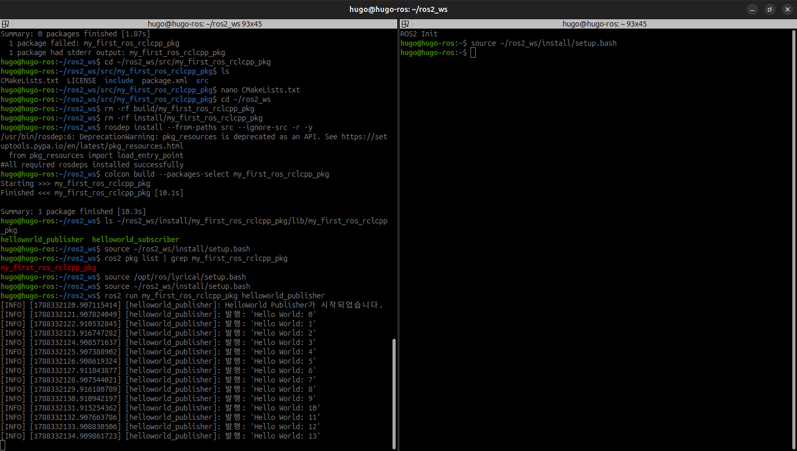
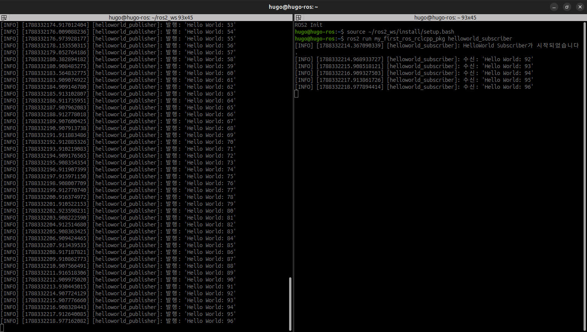
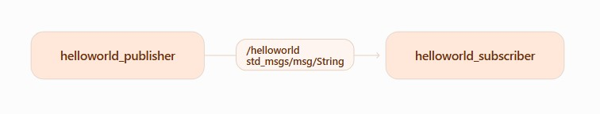
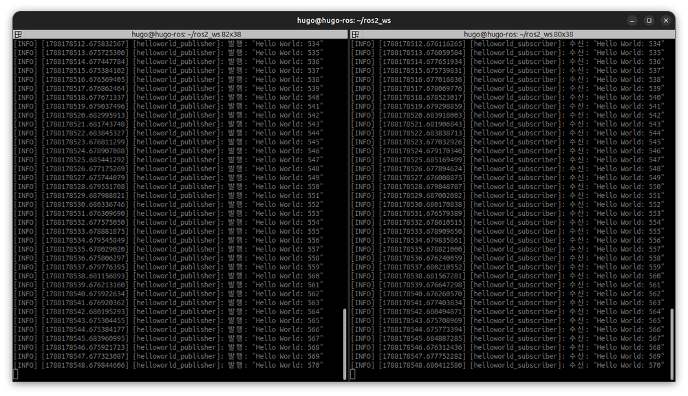

# ROS2 튜토리얼

## ROS2 프로그래밍

ROS2 코딩 스타일 가이드 이해

- ROS2 developer guide
- ROS2 Enhancement Proposals
- ROS2 Code Style

### 이름 규칙

- snake_case : 스네이크 케이스
- CamelCase : 카멜 케이스
- ALL_CAPITAL : 캐피탈

### ROS C++ Programming

- C++14 Standard 준수
- snake_case : 파일, 패키지, 인터페이스, 네임스페이스, 변수, 함수, 메서드
- CamelCase : 타입, 클래스, 구조체, 열거형
- ALL_CAPITALS : 상수, 매크로
- 소스파일 : `cpp`
- 헤더파일 : `hpp`
- 전역변수 사용시 피치 못할 경우 `g_` 접두어 추가
- 클래스 멤버 변수 마지막에 _ 추가
- 기본 들여쓰기는 2 space (탭 금지)
- `Class`의 `public:`, `protected:`, `private:`은 들여쓰기 사용하지 않음
- `char * c;` 처럼 다 띄워서 사용
- `set<list<string>>` 처럼 띄워쓰기 없이 사용


#### 기본 시작

- 콘솔에서 시작

```bash
$ ros2 pkg create my_first_ros_rclcpp_pkg --build-type ament_cmake --dependencies rcpcpp std_msgs
```


##### ROS 2 환경 적용

```bash
$ source /opt/ros/lyrical/setup.bash
$ echo $ROS_DISTRO
lyrical # 확인
```

##### 작업공간 생성

```bash
$ mkdir -p ~/ros2_ws/src
$ cd ~/ros2_ws/src
```

##### CPP 패키지 생성

```bash
$ ros2 pkg create my_first_ros_rclcpp_pkg \
  --build-type ament_cmake \
  --license Apache-2.0 \
  --dependencies rclcpp std_msgs
```

##### Publisher 노드 작성

```bash
$ nano helloworld_publisher.cpp
```

아래의 소스를 작성합니다.

```cpp
#include <chrono>
#include <functional>
#include <memory>
#include <string>

#include "rclcpp/rclcpp.hpp"
#include "std_msgs/msg/string.hpp"

using namespace std::chrono_literals;

class HelloWorldPublisher : public rclcpp::Node
{
public:
    HelloWorldPublisher()
    : Node("helloworld_publisher"), count_(0)
    {
        publisher_ = this->create_publisher<std_msgs::msg::String>(
            "helloworld", 10
        );

        timer_ = this->create_wall_timer(
            1s,
            std::bind(
                &HelloWorldPublisher::publish_message,
                this
            )
        );

        RCLCPP_INFO(
            this->get_logger(),
            "HelloWorld Publisher가 시작되었습니다."
        );
    }

private:
    void publish_message()
    {
        auto message = std_msgs::msg::String();

        message.data =
            "Hello World: " + std::to_string(count_++);

        RCLCPP_INFO(
            this->get_logger(),
            "발행: '%s'",
            message.data.c_str()
        );

        publisher_->publish(message);
    }

    rclcpp::Publisher<std_msgs::msg::String>::SharedPtr publisher_;
    rclcpp::TimerBase::SharedPtr timer_;
    std::size_t count_;
};

int main(int argc, char * argv[])
{
    rclcpp::init(argc, argv);

    rclcpp::spin(
        std::make_shared<HelloWorldPublisher>()
    );

    rclcpp::shutdown();

    return 0;
}
```

##### Subsriber 노드 작성

```bash
$ nano helloworld_subscriber.cpp
```

다음 아래의 소스코드를 작성합니다.

```cpp
#include <functional>
#include <memory>

#include "rclcpp/rclcpp.hpp"
#include "std_msgs/msg/string.hpp"

using std::placeholders::_1;

class HelloWorldSubscriber : public rclcpp::Node
{
public:
    HelloWorldSubscriber()
    : Node("helloworld_subscriber")
    {
        subscription_ =
            this->create_subscription<std_msgs::msg::String>(
                "helloworld",
                10,
                std::bind(
                    &HelloWorldSubscriber::message_callback,
                    this,
                    _1
                )
            );

        RCLCPP_INFO(
            this->get_logger(),
            "HelloWorld Subscriber가 시작되었습니다."
        );
    }

private:
    void message_callback(
        const std_msgs::msg::String::SharedPtr message
    )
    {
        RCLCPP_INFO(
            this->get_logger(),
            "수신: '%s'",
            message->data.c_str()
        );
    }

    rclcpp::Subscription<std_msgs::msg::String>::SharedPtr
        subscription_;
};

int main(int argc, char * argv[])
{
    rclcpp::init(argc, argv);

    rclcpp::spin(
        std::make_shared<HelloWorldSubscriber>()
    );

    rclcpp::shutdown();

    return 0;
}
```

##### CMakeLists.txt 설정

패키지 폴더로 이동해서,

```bash
$ cd ~/ros2_ws/src/my_first_ros_rclcpp_pkg
```

CMakeLists.txt를 엽니다.

```bash
$ nano CMakeLists.txt
```

`find\_package(std\_msgs REQUIRED)` 아래에 다음 코드를 추가합니다.

```bash
cmake_minimum_required(VERSION 3.xx)
project(my_first_ros_rclcpp_pkg)

if(CMAKE_COMPILER_IS_GNUCXX OR CMAKE_CXX_COMPILER_ID MATCHES "Clang")
  add_compile_options(-Wall -Wextra -Wpedantic)
endif()

find_package(ament_cmake REQUIRED)
find_package(rclcpp REQUIRED)
find_package(std_msgs REQUIRED)

add_executable(
  helloworld_publisher
  src/helloworld_publisher.cpp
)

target_link_libraries(
  helloworld_publisher
  PUBLIC
    rclcpp::rclcpp
    ${std_msgs_TARGETS}
)

add_executable(
  helloworld_subscriber
  src/helloworld_subscriber.cpp
)

target_link_libraries(
  helloworld_subscriber
  PUBLIC
    rclcpp::rclcpp
    ${std_msgs_TARGETS}
)

install(
  TARGETS
    helloworld_publisher
    helloworld_subscriber
  DESTINATION lib/${PROJECT_NAME}
)

if(BUILD_TESTING)
  find_package(ament_lint_auto REQUIRED)
  set(ament_cmake_copyright_FOUND TRUE)
  set(ament_cmake_cpplint_FOUND TRUE)
  ament_lint_auto_find_test_dependencies()
endif()

ament_package()
```

##### package.xml 확인

```bash
$ nano package.xml
```

로 파일에 들어가서, 아래의 코드가 있는 지 확인합니다.

```xml
<depend>rclcpp</depend>
<depend>std_msgs</depend>
```

##### 패키지 빌드하기

워크스페이스 루트로 이동하여

```bash
$ cd ~/ros2_ws
```

##### 필요한 의존성 확인

명령으로 확인합니다.

```bash
$ rosdep install --from-paths src --ignore-src -r -y
...
ERROR: your rosdep installation has not been initialized yet.  Please run:

    sudo rosdep init
    rosdep update

```

위와 같은 에러가 발생하면, 에러 메시지 가이드 대로, 명령어를 실행합니다.

```bash
$ sudo rosdep init
$ rosdep update
```

##### 패키지 빌드

특정 패키지만 빌드합니다.

```bash
$ colcon build --packages-select my_first_ros_rclcpp_pkg
Starting >>> my_first_ros_rclcpp_pkg
Finished <<< my_first_ros_rclcpp_pkg [10.1s]                     

Summary: 1 package finished [10.3s]

```

##### 빌드 결과 확인

```bash
$ ls ~/ros2_ws/install/my_first_ros_rclcpp_pkg/lib/my_first_ros_rclcpp_pkg
helloworld_publisher  helloworld_subscriber
```

##### 노드 실행하기

워크 스페이스 환경 먼저 불러옵니다.

```bash
$ source ~/ros2_ws/install/setup.bash
```

패키지 인식 확인합니다.

```bash
$ ros2 pkg list | grep my_first_ros_rclcpp_pkg
```

Publisher 를 실행합니다.

```bash
$ source /opt/ros/lyrical/setup.bash
$ source ~/ros2_ws/install/setup.bash

$ ros2 run my_first_ros_rclcpp_pkg helloworld_publisher
```




다음 Subscriber를 실행합니다.

```bash
$ ros2 run my_first_ros_rclcpp_pkg helloworld_subscriber
```


실행 설정 명령어는 동일합니다.



##### 실행 중 노드 확인

기본적으로 ROS2의 설정은 bashrc에 포함되어 있으므로 생성 패키지 셋업만 추가합니다.

```bash
$ source ~/ros2_ws/install/setup.bash
```

다음 실행중인 노드 리스트를 확인합니다.

```bash
$ ros2 node list
/helloworld_publisher
/helloworld_subscriber
```

##### 토픽 확인

```bash
$ ros2 topic list
/helloworld
/parameter_events
/rosout

```

토픽 메시지 타입도 확인해봅니다.

```bash
$ ros2 topic type /helloworld
std_msgs/msg/String

```

토픽 데이터를 직접 확인할 수도 있습니다.

```bash
$ ros2 topic echo /helloworld
data: 'Hello World: 330'
---
data: 'Hello World: 331'
---
data: 'Hello World: 332'
---
...

```

발행주기는,

```bash
$ ros2 topic hz /helloworld
average rate: 1.000
	min: 1.000s max: 1.000s std dev: 0.00000s window: 1
average rate: 1.000
	min: 1.000s max: 1.000s std dev: 0.00015s window: 2
...
```

##### 통신구조 다이어그램




| 구성 요소       | 설정값                   |
| --------------- | ------------------------ |
| Publisher 노드  | `/helloworld_publisher`  |
| Subscriber 노드 | `/helloworld_subscriber` |
| 토픽            | `/helloworld`            |
| 메시지 타입     | `std_msgs/msg/String`    |
| 발행 주기       | 1초                      |
| 발행 빈도       | 약 1Hz                   |


### ROS Python Programming

- Python 3.5 이상 사용
- snake_case : 파일, 패키지, 인터페이스, 모듈, 변수, 함수
- CamelCase : 타입, 클래스
- ALL_CAPITALS : 상수
- indent : 공백 4 space, 탭 금지
- 자료형에 따른 적절한 괄호 사용
- 모든 문자는 ' single quotes 사용

#### 기본 시작

- helloworld_publisher.py에서 문자열 메시지를 발행하고,
- helloworld_subscriber.py에서 그 메시지를 수신합니다.

```plaintext
Publisher → /helloworld 토픽 → Subscriber
```

##### ROS 2 환경 적용

```bash
$ source /opt/ros/lyrical/setup.bash
$ echo $ROS_DISTRO
lyrical # 확인
```

##### 작업공간 생성

```bash
$ mkdir -p ~/ros2_ws/src
$ cd ~/ros2_ws/src
```

##### Python 패키지 생성

Lyrical에서는 패키지 이름을 먼저 적어야 합니다.

```bash
$ ros2 pkg create my_first_ros_rclpy_pkg \
  --build-type ament_python \
  --license Apache-2.0 \
  --dependencies rclpy std_msgs
```

- 생성 후 구조:

```plaintext
~/ros2_ws/src/my_first_ros_rclpy_pkg/
├── my_first_ros_rclpy_pkg/
│   └── __init__.py
├── resource/
├── package.xml
├── setup.py
├── setup.cfg
└── test/
```

##### Publisher 파일 작성

```bash
$ cd ~/ros2_ws/src/my_first_ros_rclpy_pkg/my_first_ros_rclpy_pkg
$ nano helloworld_publisher.py
```

소스코드는 아래와 같습니다.

```python
import rclpy
from rclpy.node import Node
from std_msgs.msg import String


class HelloWorldPublisher(Node):

    def __init__(self):
        super().__init__('helloworld_publisher')

        self.publisher = self.create_publisher(
            String,
            'helloworld',
            10
        )

        self.timer = self.create_timer(
            1.0,
            self.publish_message
        )

        self.count = 0

        self.get_logger().info('HelloWorld Publisher 시작')

    def publish_message(self):
        message = String()
        message.data = f'Hello World: {self.count}'

        self.publisher.publish(message)
        self.get_logger().info(f'발행: {message.data}')

        self.count += 1


def main(args=None):
    rclpy.init(args=args)

    node = HelloWorldPublisher()

    try:
        rclpy.spin(node)
    except KeyboardInterrupt:
        pass
    finally:
        node.destroy_node()
        rclpy.shutdown()


if __name__ == '__main__':
    main()
```

##### Subscriber 파일 작성

```bash
$ nano helloworld_subscriber.py
```

소스코드

```python
import rclpy
from rclpy.node import Node
from std_msgs.msg import String


class HelloWorldSubscriber(Node):

    def __init__(self):
        super().__init__('helloworld_subscriber')

        self.subscription = self.create_subscription(
            String,
            'helloworld',
            self.receive_message,
            10
        )

        self.get_logger().info('HelloWorld Subscriber 시작')

    def receive_message(self, message):
        self.get_logger().info(f'수신: {message.data}')


def main(args=None):
    rclpy.init(args=args)

    node = HelloWorldSubscriber()

    try:
        rclpy.spin(node)
    except KeyboardInterrupt:
        pass
    finally:
        node.destroy_node()
        rclpy.shutdown()


if __name__ == '__main__':
    main()
```

##### setup.py 수정

```bash
$ cd ~/ros2_ws/src/my_first_ros_rclpy_pkg
$ nano setup.py
```

아래 부분을 찾아 추가수정합니다.

```python
entry_points={
    'console_scripts': [
        'helloworld_publisher = my_first_ros_rclpy_pkg.helloworld_publisher:main',
        'helloworld_subscriber = my_first_ros_rclpy_pkg.helloworld_subscriber:main',
    ],
},
```

##### package.xml 확인

아래의 의존성이 있는지 확인합니다. 없으면 license 아래에 추가합니다.

```xml
<depend>rclpy</depend>
<depend>std_msgs</depend>
```

##### 빌드 위치 주의

빌드는 패키지 폴더가 아니라 작업공간 최상위 폴더에서 해야 합니다.

```bash
cd ~/ros2_ws
```

```bash
$ source /opt/ros/lyrical/setup.bash
$ colcon build --packages-select my_first_ros_rclpy_pkg --symlink-install
```

정상적인 구조는 아래와 같습니다.

```plaintext
~/ros2_ws/
├── src/
├── build/
├── install/
└── log/
```

만약 잘못 생성되었다면, 아래와 같이 삭제합니다.

```bash
$ cd ~/ros2_ws/src/my_first_ros_rclpy_pkg
$ rm -rf build install log
```

##### 빌드 결과 적용

빌드 후 반드시 실행합니다.

```bash
$ source ~/ros2_ws/install/setup.bash
```

##### Publisher 실행

```bash
$ source /opt/ros/lyrical/setup.bash
$ source ~/ros2_ws/install/setup.bash

$ ros2 run my_first_ros_rclpy_pkg helloworld_publisher
```

##### Subscriber 실행

두번째 터미널에서 실행합니다.

```bash
$ source /opt/ros/lyrical/setup.bash
$ source ~/ros2_ws/install/setup.bash

$ ros2 run my_first_ros_rclpy_pkg helloworld_subscriber
```

##### 실행결과


