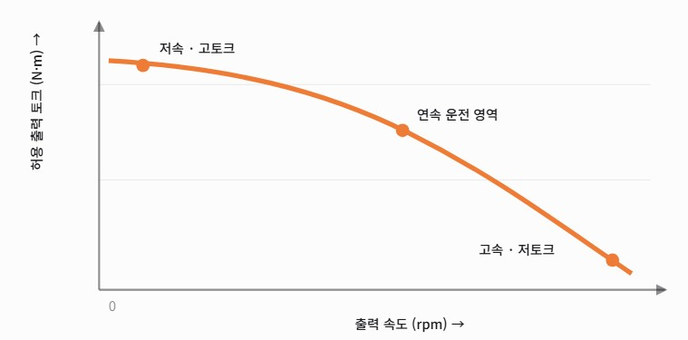
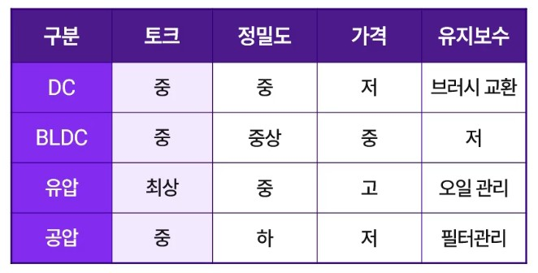
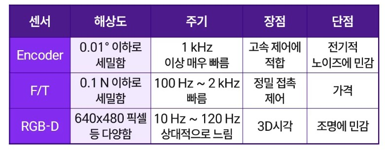
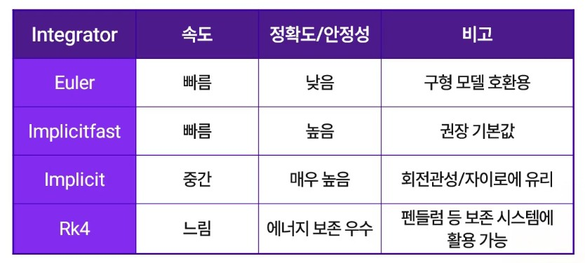
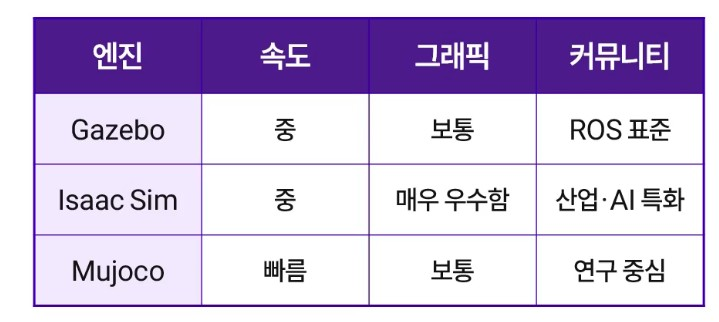

# 로봇팔, Physical AI

## 개요

### Manipulation

- 로봇이 물리적 물체를 인식하고, 잡아서, 이동시키는 조작 행위

  - Pick & Place
  - Grasping
  - Push & Pull
  - Assembling
  - Tool using

### 조작작업 유형

- 제대로 잡기 위한 유형
  - 작업 조건
  - 접촉 조건
  - 안정 조건

### 로봇팔의 기본 구조

사람의 팔과 유사하게 구성된 기계구조로 물체를 잡고, 이동시키고, 조작하는 역할을 수행하는 기기

#### 구성 요소

- 링크 : 관절 사이를 연결하는 막대 구조
- 조인트 : 회전 또는 직선이동을 가능하게 하는 구동부
- 엔드 이펙터 : 로봇팔 끝에 부착된 작업 수행 도구. 그리퍼, 흡착기 등
- 액추에이터 : 모터로 조인트를 움직이게 하는 장치
- 센서 : 위치, 속소, 힘 등을 측정해서 피드팩 하는 장치

#### 자유도

- Degree of Freedom. DOF 가 중요
- 산업용 로봇팔의 경우 6 DOF 이상

#### 스펙

- 자유도(DOF)
- 작업 범위(Raech)
- 가반 하중(Payload)

#### 자율조작 구성요소

- 지각 : 물체, 환경 인식
- 계획 : 동작 경로 및 파지 방식 결정
- 정책학습 : 데이터 기반으로 성능 향상
- 행동 : 팔/그리퍼 제어, 조작 수행

#### 지각 모듈

- ResNet, ViT(Vision Transformer), Image Classification

#### 정책 학습법

- 행동 모방학습
- 강화학습

#### Action Control

- 역기구학(Inverse Kinematics) : 로봇팔의 목표위치와 구조적 제약을 고려하여 각 조인트의 각도를 변환시키는 물리학
- 모션 제어
- 실시간 제어루프(Feedback Control)

## Actuator

입력 신호를 물리적인 움직임으로 바꾸는 장치, 각 조인트를 구동하는 요소로 회전 또는 직선 운동, 위치, 속도, 토크 등을 제어함

### 입력방식

- 전기식(모터, 서보모터), 공압식(펌프, 실린더), 유압식(고출력용)으로 구성
- 각 조인트에 1개 이상 장착

#### 전기식

- DC, BLDC, Stepper 등 전기를 이용해 회전 운동을 생성. 정밀 제어 가능

#### 공압식

- 실린더, 벨로우즈. 공기압력 기반, 구조가 간단하고 반응 속도 빠름

### 유압식

- 피스톤, 서보밸브. 유체 압력을 사용하여 강한 힘을 출력. 고출력에 적합(카센터 유압리프트)

### 감속기, 동력전달

- Harmonic Drive : 100대1 등 감속비가 높은 경우, 백래시가 거의 없음
- Planetary Gear : 10대1 수준의 감속비 상대적 낮음. 고효율
- Belt : 풀리 지름 비율로 감속비 설정

## Sensor

물리량을 전기신호로 변환하는 장치. 위치,힘,비전등 다양한 정보를 감지하는데 사용

### 센서 종류

#### 위치 센서

- Incremental Encoder : 상대적 회전량 측정. 전원 재부팅 후 기준위치 사라짐
- Absolute Encoder : 절대위치 인식. 전원이 꺼져도 위치 정보 유지

#### 힘. 토크 센서

6축 F/T 센서 : Fx, Fy, Fz . 힘 : Mx, My, Mz

로봇 손목이나 엔드 이펙터에 장착

어드미턴스 제어는 로봇에 가해지는 **힘을 센서로 측정하고, 그 힘에 따라 로봇의 위치나 속도를 움직이게 하는 제어 방식**

#### 촉각, 근접 센서

정전식이나 저항막식 압력 센서로 촉각과 유사한 감지. 섬세한 접촉 감지. IR/초음파 센서 로 근거리 물체 감지

#### 비전 센서

RGB 카메라, Depth센서, LiDAR 등...

#### 센서 퓨전

여러 센서의 데이터를 통합하여 더 정확한 상태를 추정하는 기기

카메라 + IMU, 비전 + 힘 센서 등 보완적 정보 결함으로 노이즈 감쇠 및 신뢰도 향상

#### 로봇팔 센서 배치

- 조인트 : 엔코더, 토크 센서로 관절 각도 및 힘 측정
- 손목 : 6축 F/T 센서로 접촉력과 모멘트 감지
- 엔드 이펙터 : RGB-D 카메라. 물체 인식 및 거리 정보 감지
- 베이스 : LiDAR. 주변환경의 지도 생성

## 시뮬레이션

- 비용절감, 안전확보, 빠른 반복
- 장비 손상 예방 등
- Sim-to-Real-Gap : 도메인 랜덤화

### 시뮬레이션 종류

#### MuJoCo

#### Bullet

#### ODE

Gazebo

### 속도 vs 정밀도

Time Step 조절 중요

### 데이터 증강, 랜덤화

- 질량, 마찰, 조명 랜덤화: 환경 파라미터 다양화로 현실성 가미
- 비전 노이즈 주입: 센서 오차, 블러, 왜곡등 반영
- 강인성 향상: 다양한 환경(극한환경 포함) 조건에 견디는 정책 학습

#### 로봇 시뮬레이터 요소

- Physics 엔진 : 동역학, 충돌, 마찰 등 물리 계산, 시간 적분 수행
- Renderer : 가상 카메라, 센서 시각화, 조명 효과 등
- Robot Model : URDF, USD
- API& Plugin : 유저 제어, 센서 연결, ROS 연동 등
  - Gazebo ROS Plugin
  - IsaacSim Python API
  - MuJoCo 로드
- 센서들을 가상으로 구성가능함

#### 로봇 모델 파일 종류

- URDF(Unified Robot Description Format). XML로 구성. 기본
- MJCF(MuJoCo Format). XML. 무조코 시뮬레이터 특화
- USD(Universal Scene Description). Pixar에서 개발. NVIDIA 아이작심에서 사용

### 시뮬레이션을 활용한 로봇 개발

- 모델 작성
- 시뮬레이션 테스트 및 튜닝
- 로봇 컨트롤러 이식
- 실물 검증
